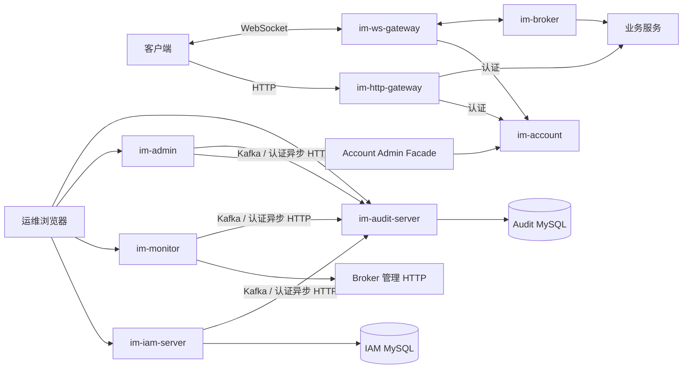

# IM Chat 架构

## 文档职责

本文是仓库级当前架构事实源，说明运行拓扑、限界上下文关系、模块依赖方向和数据所有权。模块内部组件、处理流程和一致性模型由局部 Architecture 说明：

- [Gateway Architecture](im-gateway/ARCHITECTURE.md)
- [Broker Architecture](im-broker/ARCHITECTURE.md)
- [Message Architecture](im-service/im-message/ARCHITECTURE.md)

开发和配置入口见各模块 README；设计取舍见 [`docs/design-docs`](docs/design-docs/index.md)；实施状态见 [`docs/exec-plans`](docs/PLANS.md)。局部 Architecture 只为复杂运行边界创建，Facade、SDK、聚合 POM 和单一能力 Plugin 不机械复制本文内容。

## 运行拓扑



- `im-http-gateway` 是外部 HTTP 入口和路由边界。
- `im-ws-gateway` 拥有 WebSocket 连接、握手认证、协议适配和本机投递。
- `im-broker` 拥有用户到 Gateway 的路由、Gateway 协调、精确帧投递和 Broker Gossip 同步。
- `im-service` 拥有 Account、Social、Message 业务规则和持久化事实。
- `im-management` 中的 IAM、Admin、Monitor、Audit 是独立部署的管理应用，不与普通用户认证或业务表合并。

Broker SDK 先通过 Nacos 发现一个 Broker 作为 bootstrap；首次调用成功后，周期性执行 `LIST_BROKERS` 获取集群快照并原子替换本地地址列表。Nacos 负责启动发现，Broker Registry 与 Gossip 负责运行时路由快照。

## 业务上下文与部署边界

| 限界上下文 | 部署模块 | 权威事实 |
|---|---|---|
| User、在线 Session | `im-account` | 用户、凭据、Token、Session version 和撤销状态 |
| Friend、Group | `im-social` | 好友关系、群组和成员关系 |
| Chat、Message | `im-message` | 用户视角会话、收件箱副本、消息状态和当前 Chat View |
| 管理身份、应用授权、OAuth 授权 | `im-iam-server` | 管理员、应用、Client、角色、权限和 OAuth 授权 |
| 管理 Audit | `im-audit-server` | 不可变 BUSINESS/SECURITY 审计事实 |

限界上下文是模型语言和规则的边界，不等于独立进程。一个服务可以承载多个内部上下文，但跨部署模块协作只通过 Facade、SDK 或明确的 HTTP 协议，不共享内部 Entity、Repository 或数据库表。

### Management 模块边界

| 模块 | 所有权 |
|---|---|
| `im-iam-server` | 管理员身份、SSO、应用、机器 Client、应用级 RBAC 和 OAuth2/OIDC 授权 |
| `im-iam-sdk` | 管理应用复用的 OAuth2/OIDC BFF、Token Session、Introspection 和权限目录同步；不依赖 IAM Server 实现 |
| `im-admin` | 普通用户管理用例与 UI；通过 Account Admin Facade 修改 Account 事实，不直连 Account 数据库 |
| `im-monitor` | Broker 发现、只读诊断聚合和监控 UI；不拥有路由状态或业务事实 |
| `im-audit-sdk` | 不可变 Audit Event、上下文采集、声明式审计和传输适配 |
| `im-audit-server` | Audit 接收、幂等追加、查询、UI 和受限导出；是管理 Audit 唯一持久化所有者 |

Admin、IAM、Monitor 通过按来源隔离的 Kafka 或认证异步 HTTP 向 Audit 提交事实。生产者依赖 Audit SDK，不依赖 Audit Server；管理应用通过 IAM SDK 接入身份能力，不复制 IAM 的管理员、角色或授权模型。

## 模块依赖方向

```text
im-gateway/*-server -> Gateway/Broker SDK -> Service Facade
im-broker-server    -> Broker/Gateway SDK -> Message Facade
im-service/*-server -> own Facade + dependent Facade/SDK
im-management       -> IAM SDK / Audit SDK / Account Admin Facade / generic Plugin
Facade / SDK        -> im-common + stable framework contract
im-plugin           -> generic framework integration
im-common           -> no business/runtime module dependencies
im-test             -> test-scope access to runtime modules; no production code
```

必须保持以下边界：

1. Shared module 不依赖运行模块或业务模块。
2. SDK、Facade 不依赖其 Server 实现。
3. Plugin 不依赖 Broker、Gateway 或业务服务包。
4. Domain 不依赖 interfaces、infrastructure、configuration、lifecycle 或 Spring 类型。
5. Controller、RPC Handler 只做协议适配并委托 Application/Domain Service，不直接访问具体持久化实现。
6. Bolt、Dubbo、Nacos、Redis、HTTP 等运行协议在边界完成转换，不进入领域模型。
7. `im-web` 只拥有通用 HTTP 行为；Session-to-Servlet 适配属于 `im-session`，IAM 身份语义属于 IAM。

机械可判断的依赖规则由 `im-test/im-architecture-test` 与 `scripts/check-drift.sh` 执行；跨模块实时运行旅程由 `im-test/im-e2e-test` 验证。业务语义和合理例外由 Review 判断。

## 数据与运行状态所有权

- Account、Social、Message 分别拥有 `im_chat_account`、`im_chat_social`、`im_chat_message` MySQL Schema，不共享表或执行跨 Schema SQL。
- IAM 的 `im_chat_iam` 拥有管理身份、应用、Client、角色、权限和 OAuth 授权；只持久化 Token digest。
- Audit 的 `im_chat_audit` 是管理 Audit 唯一权威，按 `auditId` 幂等追加事实；生产者只依赖 Audit SDK。
- WebSocket Gateway 拥有本机 `connectionId`、Netty Channel、身份和 Session version；Broker 不保存远端 Channel 或本机连接 ID。
- Broker 只保存定位用户 Gateway 所需的路由状态；Broker/Gateway Registry 与 Connection Gossip view 经 Gossip 最终一致同步，业务 Connection Registry 只保存当前 owner 的路由。
- Account Session version 是撤销权威。Broker 路由 `userId + oldSessionVersion` 关闭控制，目标 Gateway 只关闭匹配旧版本的本机连接。
- Message 的 MySQL 保存聊天与收件箱事实；Redis `ImChatView` 只影响未读判断，Receipt 状态只用于通知确认和有界重投。
- Management 应用各自的 Redis 只保存加密 BFF Token Session 和有界 Introspection cache，不成为普通用户、权限或 Audit 事实源。

## 跨模块一致性边界

- MySQL 单服务事务只保证所属 Schema 内的写入；跨服务调用不形成分布式事务。
- Message 在事务提交后发起在线通知，推送失败不回滚已提交消息。
- Broker Registry/Gossip 是运行态最终一致模型，不替代业务持久化或强一致事务日志。
- Nacos 提供配置和服务发现，不拥有用户路由或业务状态。
- Monitor 只聚合有界、只读的 Broker 诊断；节点失败不会改变 Broker 状态。
- Audit 通过 Kafka 或认证异步 HTTP 接收，依赖来源校验、重试和 `auditId` 幂等，而不是调用方本地审计表。

## 变更规则

- 跨模块拓扑、上下文部署、依赖方向或数据所有权变化时更新本文。
- 模块内部组件关系、一致性模型或关键处理链路变化时更新对应局部 Architecture。
- 运行配置、开发入口和面向使用者的模块行为更新模块 README。
- 难以逆转且存在真实取舍的决策进入 `docs/design-docs`；多步骤实施进入 `docs/exec-plans/active`。
- 可靠性或安全保证变化时同步更新 [`RELIABILITY.md`](docs/RELIABILITY.md) 或 [`SECURITY.md`](docs/SECURITY.md)。
