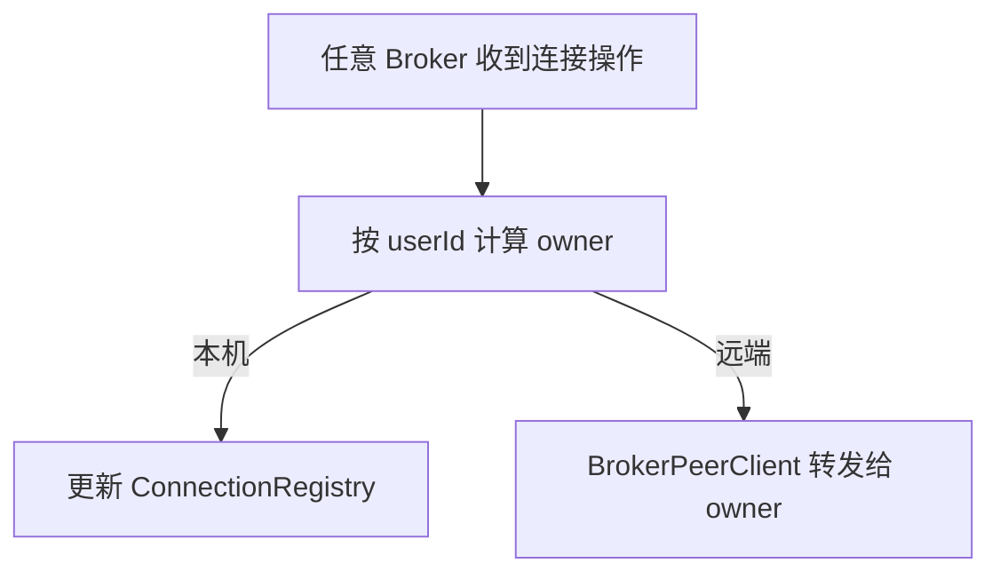
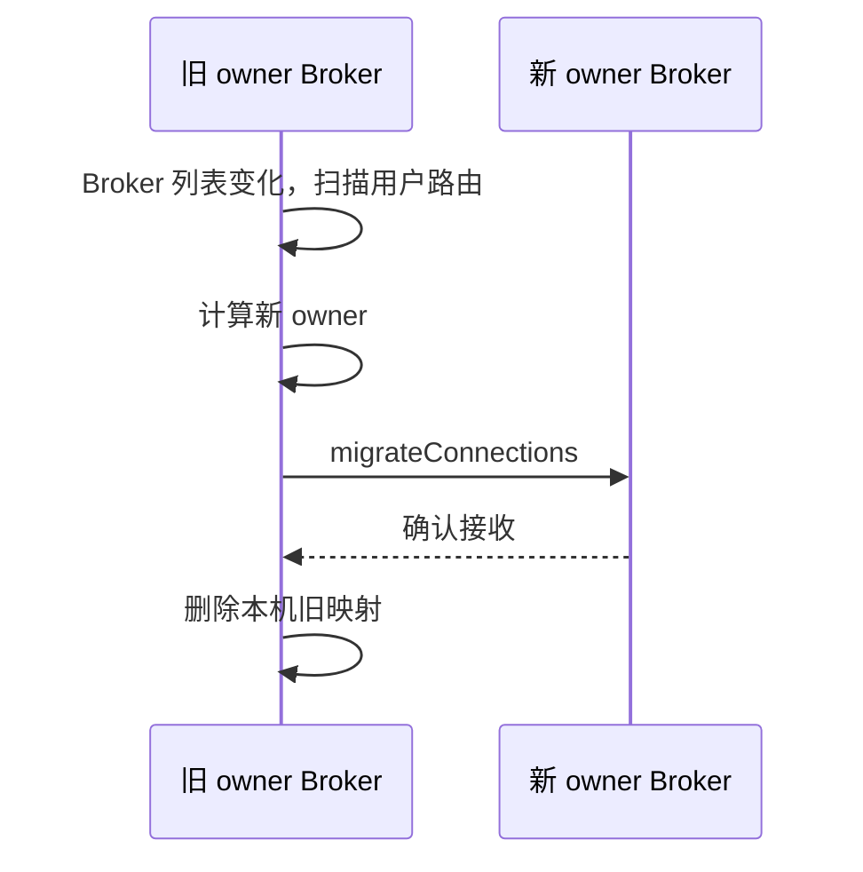
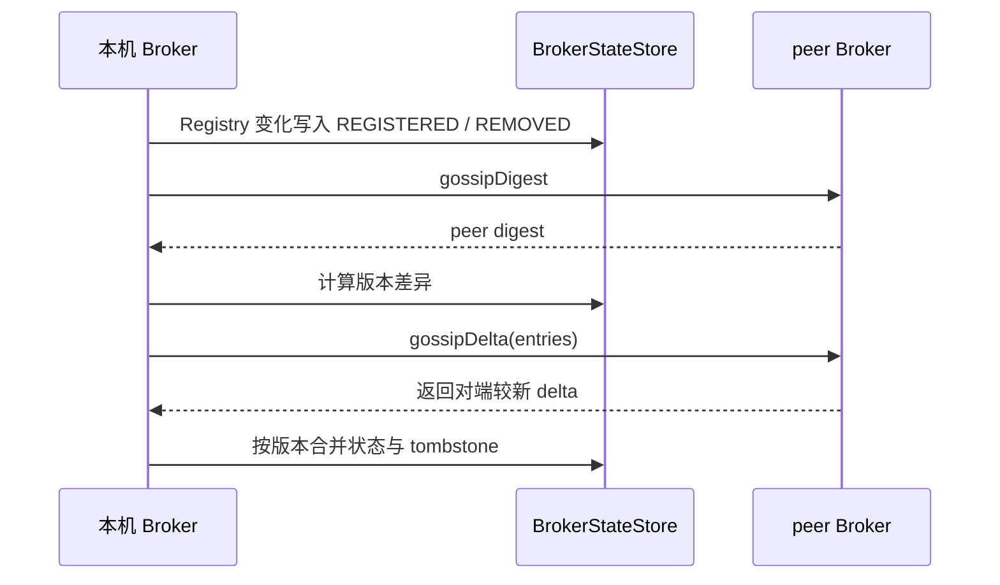
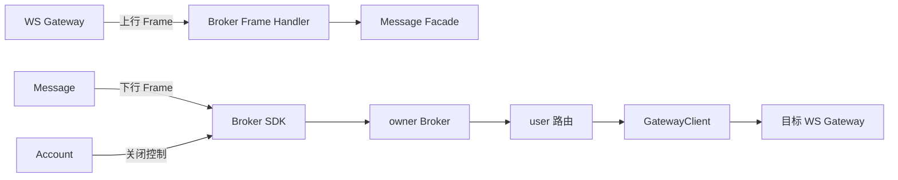

# Broker Architecture

## 职责与状态模型

Broker 是实时路由协调层，不是消息存储。它持有 Broker、Gateway 和用户连接位置的运行态注册表，把上行帧交给 Message，把下行帧写到目标 Gateway，并通过 Gossip 让多个 Broker 最终收敛。

```text
Registry 状态
  BrokerRegistry      brokerId -> Broker
  GatewayRegistry     gatewayId -> Gateway
  ConnectionRegistry  userId <-> gatewayId

业务写入 -> 内部事件 -> BrokerStateStore -> Gossip digest/delta -> peer Broker
```

## 用户归属与连接路由



归属计算为 `sortedBrokerIds[floorMod(hash(userId), brokerCount)]`。

`ConnectionRegistry` 同时维护 user 到 gateway 和 gateway 到 user 的索引。前者服务用户投递，后者服务 Gateway 快照同步和失效清理。Broker 不保存 Gateway 本机 connectionId。

业务 `ConnectionRegistry` 只保存当前 Broker 归属的路由。远端 Connection delta 保存在 `BrokerStateStore` 的 Gossip entries 中，用于版本比较、删除传播和快照收敛，不投影成可供本机业务投递的 Connection Registry 项，因此不会让每个 Broker 持有全量业务连接索引。

## 成员变化与迁移



迁移先远端确认、后本地删除，避免正常失败路径直接丢失路由。它不是跨节点事务：超时、节点故障和并发成员变化仍通过后续扫描与 Gossip 收敛，诊断 Tracker 只记录结果，不参与正确性决策。

## Gossip 一致性



- Gossip 是最终一致同步，不是强一致事务或业务事件总线。
- 删除使用 `REMOVED` 墓碑并保留配置 TTL，防止暂时离线的节点用旧状态复活已删除路由。
- Registry TTL 清理失联 Broker/Gateway/Connection；TTL 与 Gossip tombstone TTL 分别解决活性和删除传播问题。
- `im-gossip` 提供通用 digest/delta 算法，Broker 通过 `BrokerStateStore` 适配业务状态。

## 帧与控制流



下行允许多 Gateway、多连接和部分失败。Broker 汇总 Gateway 返回的逐连接结果，但不持有 ReceiptTask、不决定业务重投，也不把 Gateway 接受写入解释为客户端 ACK。关闭控制中的 Session version 只由 Gateway 与本机连接比较，Broker 不判断 Token 是否有效。

## 诊断边界

管理 HTTP 与业务 Bolt 使用独立端口。诊断接口只读、限制查询范围，Gossip/迁移历史使用固定容量内存；诊断写入失败不会改变注册、迁移或同步结果。Monitor 通过 Nacos metadata 发现管理地址，不根据 Bolt 端口猜测。

## 依赖规则

- `im-broker-sdk` 只定义调用契约、Params、DTO 和客户端，不依赖 Server。
- Broker Server 可以依赖 Gateway SDK、Message Facade 与通用 Gossip/Bolt/Dubbo Plugin。
- RPC Handler 只解析协议并委托，归属、迁移和同步算法位于 Domain Service/Store。
- Broker 不访问 Message、Account、Social 数据库，也不持有 Gateway Channel。
