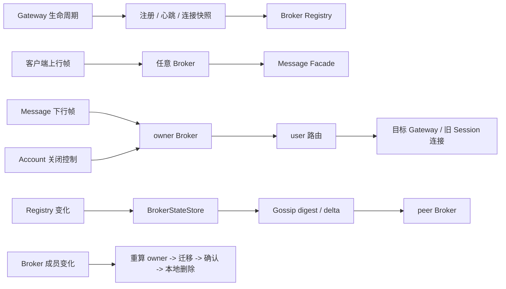

# im-broker

## 模块作用

`im-broker` 是 IM 实时链路的 Broker 聚合模块，负责承接 WS gateway、message service 和 Broker 集群内部的实时调用。

注册表、用户归属、迁移、Gossip 和帧路由的一致性边界以 [Broker Architecture](ARCHITECTURE.md) 为准。

Broker 不处理消息领域业务，也不保存历史消息。它只维护在线投递所需的运行态索引：Broker 实例、WS gateway 实例、用户到 gateway 的连接映射，并把上行帧转交 message service，把下行帧写入目标用户所在的 WS gateway。

## 模块结构

```text
im-broker/
  im-broker-sdk/       # Broker 内部调用 SDK、Params、DTO、RPC service/operation 标识
  im-broker-server/    # Broker 运行服务，提供 Bolt RPC 入口、连接索引和 Gossip 状态同步
  pom.xml              # Broker 聚合 POM
```

## 运行架构

```text
                  ┌────────────────────┐
                  │    im-ws-gateway   │
                  │ local connections  │
                  └─────────┬──────────┘
                            │ register / heartbeat / sync / frame
                            ▼
┌────────────────────────────────────────────────────────┐
│                       im-broker                         │
│  interfaces.handler                                     │
│    broker / gossip / gateway / connection / frame        │
│                                                        │
│  domain.registry                                        │
│    BrokerRegistry / GatewayRegistry / ConnectionRegistry │
│                                                        │
│  domain.service                                         │
│    BrokerConnectionService                              │
│                                                        │
│  domain.store                                           │
│    BrokerStateStore                                     │
└───────────────┬──────────────────────────┬─────────────┘
                │                          │
                │ Dubbo                    │ Bolt
                ▼                          ▼
        ┌──────────────┐          ┌────────────────┐
        │ im-message   │          │ peer brokers   │
        │ business     │          │ gossip sync    │
        └──────────────┘          └────────────────┘
```

## 核心流程导航



稳定的状态所有权和一致性模型见 [Broker Architecture](ARCHITECTURE.md)，具体 Handler、Lifecycle、配置和诊断接口见 [Broker Server README](im-broker-server/README.md)。

## RPC 边界

Broker SDK 通过 `BrokerBoltService` 和 `BrokerBoltOperation` 固定内部 RPC 边界。

| Service | Operation | 说明 |
|---------|-----------|------|
| `broker.broker` | `registerBroker`、`unregisterBroker`、`heartbeatBroker`、`listBrokers` | Broker 实例管理 |
| `broker.gossip` | `gossipDigest`、`gossipDelta` | Broker 间状态摘要和增量同步 |
| `broker.gateway` | `registerGateway`、`unregisterGateway`、`heartbeatGateway` | WS gateway 实例管理 |
| `broker.connection` | `registerConnection`、`unregisterConnection`、`syncConnections`、`migrateConnections`、`closeConnections` | 用户到 gateway 的连接索引管理及会话关闭控制 |
| `broker.frame` | `writeFrame` | 上行帧转交 message service，下行帧写入 WS gateway |

`AbstractBrokerRpcHandler<I, O>` 负责统一反序列化入参、调用 `process(I params)` 并返回结果。具体 handler 只关心自己的 Params 和 Result 类型。

## 连接索引

Broker 当前只保存用户到 gateway 的映射，不保存 gateway 本机的具体 `connectionId` 集合。一个用户可能同时连接多个 gateway，因此连接索引的核心形态是：

```text
userId -> Set<gatewayId>
```

具体的 WebSocket channel、connectionId 和写入结果由 `im-ws-gateway` 本机维护。Broker 收到下行帧时先根据 `userId` 查到 gateway，再调用对应 gateway 的 frame 写入接口。

`ConnectionRegistry` 只暴露注册、注销、查询、列表和同步接口：

```text
register(ConnectionRegisterParams)
unregister(ConnectionUnregisterParams)
find(userId)
list()
sync(gatewayId, userIds)
```

`sync` 用于处理 gateway 上报的当前活跃用户快照。Broker 会保留快照内的用户映射，并清理该 gateway 下没有继续上报的旧映射。

## Broker 归属

用户连接注册和注销可以请求到任意 Broker。Broker 会根据当前 Broker 列表和 `userId` 选择该用户的归属 Broker：

```text
owner = sortedBrokerIds[floorMod(hash(userId), brokerCount)]
```

如果当前 Broker 不是该用户的归属 Broker，请求会通过 `BrokerPeerClient` 转发给归属 Broker；如果当前 Broker 就是归属 Broker，则直接写入本地 `ConnectionRegistry`。

账号服务发出的会话关闭控制同样可以请求到任意 Broker。非归属 Broker 先转发给归属 Broker，归属 Broker 再根据 `userId -> gatewayId` 路由把控制发给相关 Gateway。Broker 不判断会话是否有效；Gateway 只关闭匹配控制中旧 `sessionVersion` 的本机连接。

当 Broker 成员发生变化时，用户归属可能变化。`BrokerConnectionService` 会定期检查本地连接索引，把不再归属当前 Broker 的用户映射迁移给新的归属 Broker，并在迁移成功后从本地注销旧映射。

## 集群同步

Broker/Gateway/Connection registry 的变化会发布 Broker 内部事件，再由对应 listener 写入 `BrokerStateStore`。`BrokerStateStore` 是 broker 对 `im-gossip` 暴露的业务状态适配层。

`im-plugin/im-gossip` 提供通用同步能力：

| 组件 | 说明 |
|------|------|
| `GossipSyncStore` | 业务状态读写接口 |
| `GossipSynchronizer` | digest/delta 对比与合并逻辑 |
| `GossipPeerClient` | peer Broker 调用抽象 |
| `GossipDeltaEntry` | 单条同步增量，包含 key、entityType、operation、payload 和 version |

Broker server 通过 `BrokerSyncDigestHandler` 和 `BrokerSyncDeltaHandler` 暴露 gossip 同步入口。当前 registry 使用内存实现，Broker 之间通过 gossip 做最终一致同步。

## 生命周期

| 类 | 说明 |
|----|------|
| `BrokerRegistrationLifecycle` | 启动时注册当前 Broker，运行中发送 Broker 心跳，停止时注销当前 Broker |
| `BrokerGossipLifecycle` | 定时选择 peer Broker 执行 gossip digest/delta 同步 |
| `BrokerConnectionLifecycle` | 定时检查连接归属变化并迁移用户 gateway 映射 |

## 关键技术点

- Broker 只维护在线路由，不保存消息事实，也不持有远端 Netty Channel。
- 用户连接按一致的 Broker 选择算法分片，成员变化通过迁移收敛。
- Broker/Gateway/Connection 状态使用 Gossip 最终一致同步，业务写入和同步传播通过事件分离。
- 内部 RPC 契约集中在 SDK，Server Handler 通过泛型基类统一 JSON 解析。

Broker ID 根据 `im.broker.instance.host` 和 `im.broker.instance.port` 自动生成，格式为 `broker-{host}-{port}`。

## 技术难点与故障边界

- 任意 Broker 都能接收请求，但只有计算出的 owner 修改该用户的权威路由；转发失败不能在非 owner 节点静默写入第二份状态。
- Connection Registry 需要同时支持按用户投递和按 Gateway 快照清理，因此维护 user/gateway 双向索引；两个方向必须在同一注册表操作中更新。
- 成员变化会改变 owner。迁移采用远端确认后本地删除，失败时保留旧映射等待重试；这降低丢失风险，但不构成跨节点事务。
- Gossip 同步与业务写入解耦，删除必须使用带 TTL 的 tombstone，避免离线 peer 重新传播旧状态。
- 下行可能出现部分 Gateway 或部分连接失败。Broker 返回逐连接结果，Message 决定回执与重投；Broker 不把局部成功压缩成客户端已确认。
- 诊断 Tracker 与管理 HTTP 必须失败隔离，不能因为记录或页面查询失败影响注册、迁移、Gossip 或帧路由。

## 边界说明

- 外部模块依赖 `im-broker-sdk` 调用 Broker，不依赖 `im-broker-server` 运行实现。
- WS gateway 通过 Bolt 调用 Broker 注册 gateway、发送 gateway 心跳、注册/注销用户连接、同步连接快照和提交上行帧。
- Message service 通过 Broker SDK 写入下行帧，Broker 根据连接索引调用对应 WS gateway。
- Account service 通过 Broker SDK 发布会话关闭控制，Broker 只负责按用户路由，不保存 Account Session 状态。
- Broker 间同步能力由 `im-plugin/im-gossip` 抽象，Broker server 只负责把业务状态适配成 gossip store。
- Broker 不依赖 gateway 本地连接实现，也不处理消息落库、会话状态、好友关系或群成员校验。
- Broker 返回逐连接下行结果，但不持有消息通知回执任务；ACK 和有界重投由 Message service 负责。

## 验证命令

```bash
mvn -q -pl im-broker/im-broker-server -am test
```
