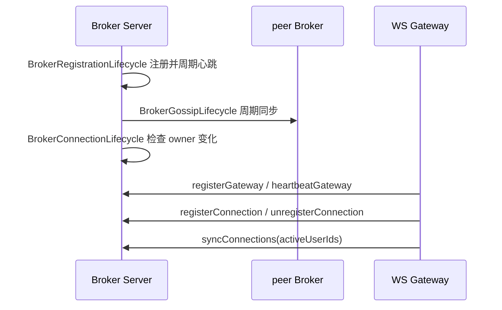
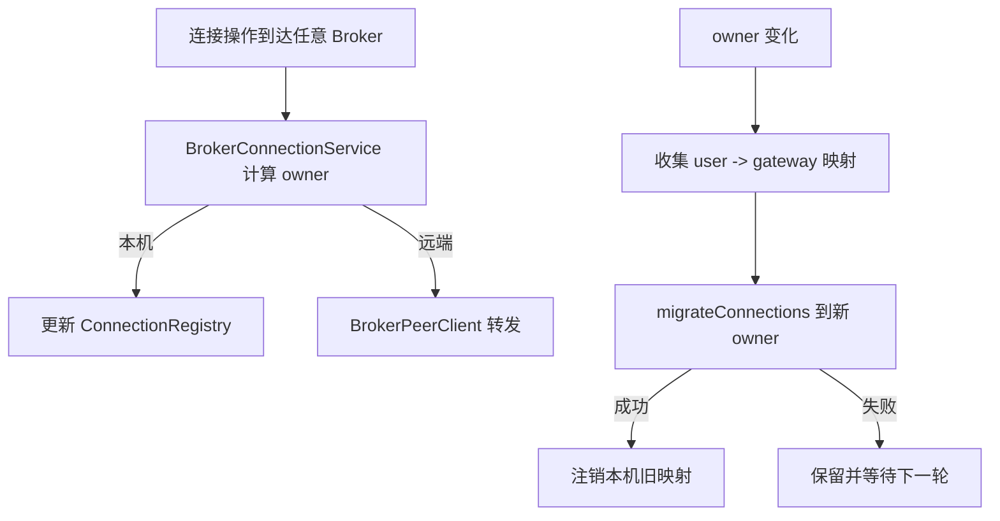
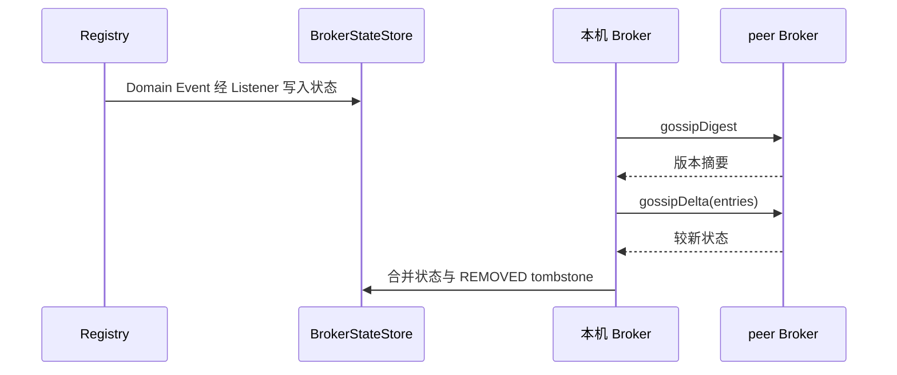
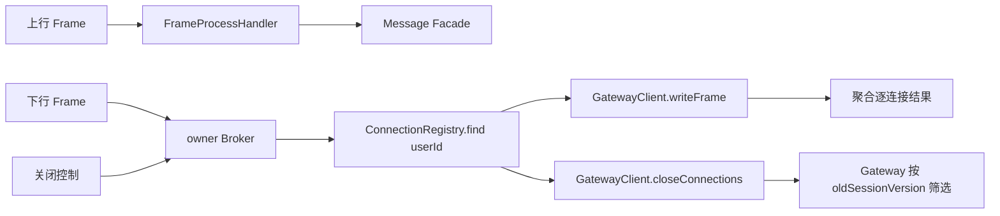

# im-broker-server

Broker 运行服务，提供 Bolt RPC 入口、运行态注册表、连接归属迁移、Broker 间 Gossip 同步，以及独立端口上的只读诊断接口。

## 代码结构

```text
broker/
  config/                    # 客户端、注册表和配置属性装配
  domain/registry/           # Broker、Gateway、Connection 注册表及内存实现
  domain/service/            # 用户连接归属与迁移
  domain/store/              # Gossip 业务状态投影
  interfaces/handler/        # Broker/Gateway/Connection/Frame RPC Handler
  interfaces/http/management # 只读管理 HTTP Controller
  interfaces/listener/       # 注册事件到 Gossip 状态的适配
  lifecycle/                 # 本机注册、Gossip、连接迁移任务
  support/diagnostic/        # Broker 技术诊断子系统
    model/                   # DTO、响应及状态模型
    service/                 # 诊断查询服务
    tracker/                 # 通用 Tracker 契约及共享状态
      impl/                  # Gossip、迁移诊断 Tracker 实现
  support/                   # peer client 与内部事件发布
  transformer/application/   # Registry 状态到诊断 DTO
  transformer/interfaces/    # 应用诊断 DTO 到 HTTP Response
```

## 运行模型

- Broker、Gateway 和用户到 Gateway 的映射均保存在各自内存注册表中。
- 用户连接按 `userId` 在 Broker 集群中确定归属；成员变化后迁移到新 Broker。
- Broker/Gateway/Connection 状态通过 `im-gossip` 最终一致同步。
- 上行帧通过 Dubbo 调用 message service；下行帧通过 WS Gateway SDK 精确写入网关。
- 会话关闭控制先按 `userId` 定位归属 Broker，再路由到持有该用户连接的 Gateway。
- 本模块不保存聊天历史和 WebSocket `connectionId` 集合。

## 核心处理流程

### Broker 与 Gateway 生命周期



Gateway 快照同步按 gatewayId 清理已不在快照中的旧用户映射；Registry TTL 继续处理进程崩溃后没有正常注销的状态。

### 连接归属与迁移



### Gossip 同步



### 帧与关闭控制



## 配置

- `im.broker.instance`：本机 Broker 地址，ID 自动生成。
- `im.broker.cluster`：种子、fanout、同步超时和删除状态 TTL。
- `im.broker.registry`：Broker/Gateway/Connection TTL。
- `im.broker.gateway-push`、`im.broker.peer-call`：网关与 peer 调用超时。
- `im.bolt.server.port`：Broker Bolt 端口，同时作为非 Web Nacos 服务端口。
- `im.broker.management.host`、`port`：管理 HTTP 监听地址和端口，默认 `127.0.0.1:12201`。
- 用户连接路由诊断中的注册时间来自路由 `connectedAt`，最后活跃时间来自 `refreshedAt`；管理接口分别输出为 `registeredAt` 和 `lastSeenAt`。
- `im.broker.management.history-capacity`：Gossip 和连接迁移最近记录容量，默认 `100`。

启动类为 `ImBrokerApplication`。Bolt 默认监听 `12200`，管理 HTTP 默认监听 `127.0.0.1:12201`，二者不能配置为同一端口。Nacos 实例的主端口仍是 Bolt 端口，管理地址只通过 `management-host`、`management-port` metadata 发布。

管理 HTTP 的 OpenAPI 页面为 `GET /api/doc.html`，API description 为 `GET /v3/api-docs`。

## 只读诊断接口

| 接口 | 内容 |
|---|---|
| `GET /management/broker/overview` | 当前节点、注册表统计、Gossip/迁移累计摘要 |
| `GET /management/brokers` | 当前节点已知 Broker 快照 |
| `GET /management/gateways` | 当前节点已知 Gateway 快照 |
| `GET /management/connections?userId=...` | 单个用户的 Gateway 路由 |
| `GET /management/gossip` | Gossip 累计摘要 |
| `GET /management/gossip/records?limit=...` | 最近 Gossip 记录，`limit` 为 `1..100` |
| `GET /management/migrations?limit=...` | 最近迁移记录，`limit` 为 `1..100` |

接口没有写操作，也不允许空条件获取全量用户路由。普通响应和异常由 `im-web` 统一包装为
`HttpResult`。Gossip 与迁移记录只保存在固定容量内存中，重启即清空；诊断记录失败不会改变
原业务执行结果。

`/management/**`、Broker Actuator 和 OpenAPI 路径不建立普通用户 `UserContext`，访问控制依赖
管理监听地址、网络策略和调用方基础设施。默认只监听 `127.0.0.1`；对其他主机开放时必须由部署
环境限制来源，不能把可伪造的用户身份 Header 当作管理接口认证。

Gossip 生命周期在每次 peer 同步结束后记录合并与推送条目数；Broker peer 客户端在连接迁移 RPC
结束后记录成功数量或失败摘要。失败记录的 `processedCount` 为 `0`，不把已尝试的数量当作已处理数量。

## 关键技术点

- 用户到 Gateway 的映射按 `userId` 分片到归属 Broker，避免每个 Broker 保存全量连接索引。
- 任意 Broker 都可接收连接注册、注销和关闭请求；非归属节点通过 `BrokerPeerClient` 转交归属 Broker。
- `InMemoryConnectionRegistry` 同时维护 user 和 gateway 两个方向的索引，使按用户查询和按网关快照清理都能直接定位。
- Broker 成员变化后先把连接映射迁移到新归属节点，远端确认成功后再删除本地数据。
- 注册表变化先发布内部事件，再由 Listener 写入 Gossip 状态，注册业务与同步机制解耦。
- Gossip 提供最终一致性；连接写入仍由归属 Broker 串联，不能把 Gossip 当作强一致事务日志。
- 删除状态通过 `REMOVED` 增量和 TTL 传播，防止离线节点重新带回旧注册数据。
- 关闭控制携带旧 `sessionVersion`，Broker 不解释该字段，只把它透传给 Gateway 做本地连接筛选。

## 故障处理与排查入口

| 故障 | 当前行为 | 主要证据 |
|---|---|---|
| peer Broker 调用失败 | 当前写入/迁移失败，保留可重试状态并记录诊断 | Gossip/迁移 Tracker、warn 日志 |
| Gateway 下行失败 | 保留逐连接失败结果返回调用方 | Frame write result、`im.message.broker.frame.write` |
| Message Facade 超时 | 上行帧返回未处理，不在 Broker 落消息 | Frame Handler 日志与结果 |
| Gateway 异常消失 | 心跳/TTL 与后续快照清理路由 | Registry 状态、管理接口 |
| 诊断记录失败 | 只记录失败，不改变核心操作结果 | Tracker 聚焦测试 |

只读管理端点用于判断当前节点看见的 Registry、最近 Gossip 与迁移结果，不是强一致集群真值。跨节点问题需要同时比较多个 Broker，并结合 [Broker Architecture](../ARCHITECTURE.md) 的最终一致性边界判断。

```bash
mvn -q -pl im-broker/im-broker-server -am test
```
