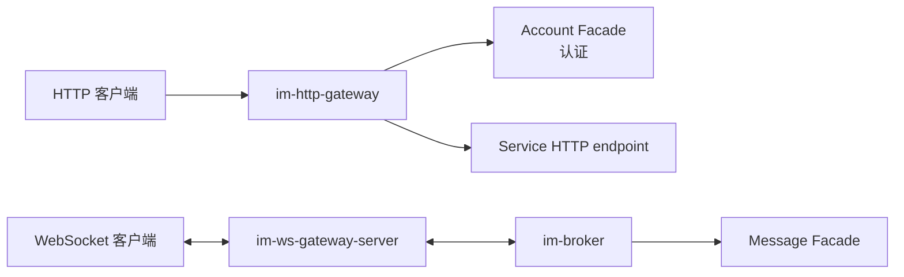
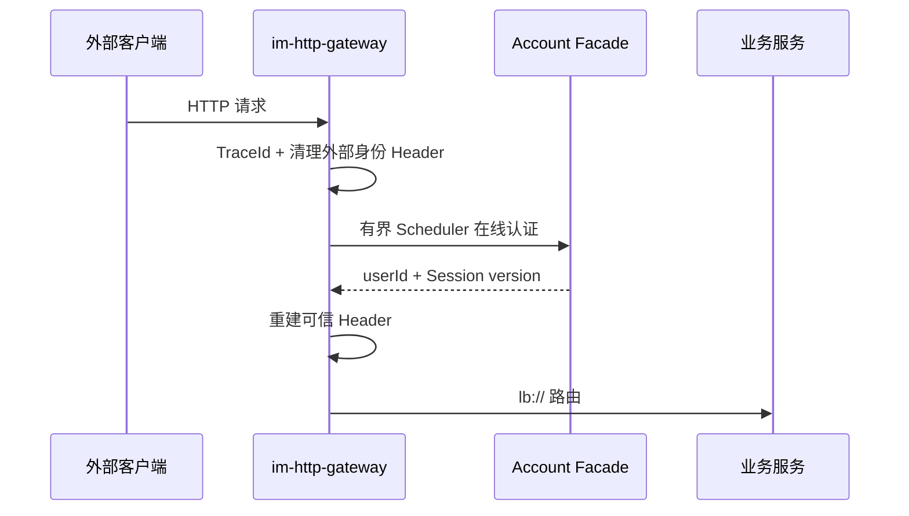
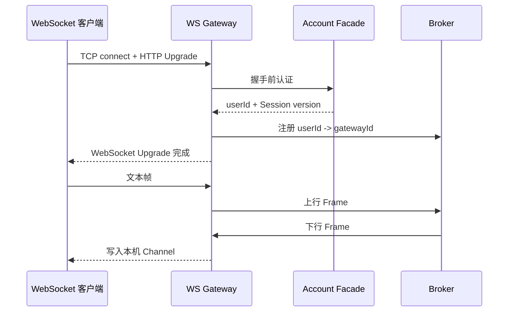

# Gateway Architecture

## 职责与边界

`im-gateway` 终止外部 HTTP/WebSocket 协议，建立可信身份上下文，并把请求或实时帧路由到内部服务。Gateway 不拥有 Account、Social、Message 业务事实。

HTTP 与 WebSocket 分成独立进程：前者面向短请求、WebFlux Filter 和服务发现路由；后者面向长连接、Netty Channel 生命周期和 Bolt 内部调用。两者共享认证权威，但不共享连接状态或协议 Handler。

## HTTP Gateway

- 外部传入的内部身份 Header 必须先删除，再根据 Account 认证结果重建。
- 阻塞式 Dubbo 认证离开 Reactor event loop，在有界 Scheduler 中执行；超时或 Account 不可用时 fail closed。
- Gateway 只路由 `/account/**`、`/social/**`、`/message/**`，不编排业务用例。

## WebSocket Gateway

- 每条连接的 `userId`、`sessionVersion`、`connectionId` 和 Channel 只保存在所属 Gateway。
- Broker 只获得 `userId -> gatewayId`，不获得 Channel 或 connectionId。
- 心跳、读空闲、帧大小和协议升级由显式 Netty pipeline 管理；阻塞认证使用专用有界线程池，完成后回到 Channel EventLoop。
- 下行写入结果逐连接返回，只表示 Gateway 接受写入，不等于客户端业务 ACK。
- Account 退出或替换 Session 时，Gateway 只关闭匹配旧 `sessionVersion` 的连接，避免乱序关闭新会话。

## 状态与失败边界

| 状态 | 所有者 | 恢复或清理 |
|---|---|---|
| HTTP 请求身份 | 单次请求上下文 | 请求结束清理 |
| WebSocket Channel 与 connectionId | 目标 WS Gateway | Channel 关闭时本地删除并通知 Broker |
| user -> gateway 路由 | Broker | 注册、注销、快照同步与 TTL 收敛 |
| Access Token 与 Session version | Account | Gateway 每次握手/HTTP 请求在线校验 |
| ReceiptTask 与 ACK | Message | Gateway 只转发，不持久化或重试 |

Broker 暂时不可用时，已建立连接仍由本机持有，但注册、上行转发和下行定位可能失败；生命周期任务继续重试注册/心跳。Gateway 不通过本地缓存伪造 Account 认证成功，也不把写入 Channel 成功升级为消息已处理。

## 依赖规则

- `im-http-gateway` 可以依赖 Service Facade 和通用 Plugin，不依赖 WS Server。
- `im-ws-gateway-server` 依赖 Gateway SDK、Broker SDK、Account Facade 和通用 Plugin。
- `im-ws-gateway-sdk` 只保存 Bolt 契约和客户端，不依赖 Netty Server 实现。
- 外部协议模型在 Gateway 边界终止，业务服务不依赖 Netty、WebFlux 或 Gateway 内部类型。
