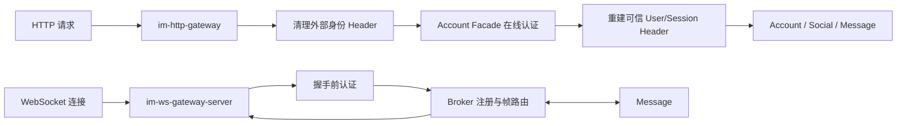

# im-gateway

## 模块作用

`im-gateway` 是 IM 系统的网关聚合模块，负责承载外部访问入口相关代码。

HTTP/WS 进程边界、身份信任、连接所有权和 Broker 协作以 [Gateway Architecture](ARCHITECTURE.md) 为准。

当前网关按协议拆分为两类：

- `im-http-gateway`：HTTP API 统一入口，基于 Spring Cloud Gateway 转发到后端业务服务。
- `im-ws-gateway`：WebSocket 实时连接入口，负责浏览器 WS 长连接接入和内部推送入口。

## 模块结构

```text
im-gateway/
  im-http-gateway/    # HTTP 网关服务
  im-ws-gateway/      # WebSocket 网关聚合模块
  pom.xml             # 网关聚合 POM
```

## 端到端流程



HTTP 与 WS Gateway 都依赖 Account 的在线认证结果，但只有 WS Gateway 持有连接状态。Broker 只持有用户到 Gateway 的位置，Message 只持有消息、回执和 ACK 业务状态。

### 文档导航

| 关注点 | 文档 |
|---|---|
| 两类 Gateway 的进程边界、状态所有权和依赖方向 | [Gateway Architecture](ARCHITECTURE.md) |
| HTTP Filter 顺序、路由与认证失败 | [HTTP Gateway README](im-http-gateway/README.md) |
| Socket 生命周期、Netty/Tomcat 选型和上下行链路 | [WS Gateway README](im-ws-gateway/README.md) |
| Netty pipeline、连接注册表、配置与故障处理 | [WS Gateway Server README](im-ws-gateway/im-ws-gateway-server/README.md) |
| Broker 调用 WS Gateway 的内部契约 | [WS Gateway SDK README](im-ws-gateway/im-ws-gateway-sdk/README.md) |

## 边界说明

- HTTP 流量通过 `im-http-gateway` 进入后端服务。
- WebSocket 流量通过 `im-ws-gateway-server` 接入，再由 Broker 路由到业务服务。
- 网关层只做接入、安全、协议转换、路由和连接管理，不承载业务领域逻辑。

## 关键技术点

- HTTP 与 WebSocket 按短请求路由和长连接管理拆成独立进程，扩容策略互不影响。
- 两类网关都通过 Nacos 注册；HTTP 使用服务发现路由，WS 通过 Broker 维护在线位置。
- 外部协议在网关终止，内部调用使用 Facade/Bolt SDK，避免业务服务依赖接入协议。
- 两类入口都 fail closed：Account 认证失败、超时或不可用时，不构造可信身份，也不继续进入业务服务。
- HTTP 的难点是非阻塞 Filter 链与阻塞 Dubbo 认证的隔离；WS 的难点是 EventLoop、连接生命周期、Broker 路由和 Session 替换控制之间的顺序。
- Gateway 写入成功只说明请求已进入下游或 Channel 接受帧，不提升为业务事务成功或客户端 ACK。

## 验证命令

```bash
mvn -q -pl im-gateway/im-http-gateway,im-gateway/im-ws-gateway/im-ws-gateway-server -am test
```
