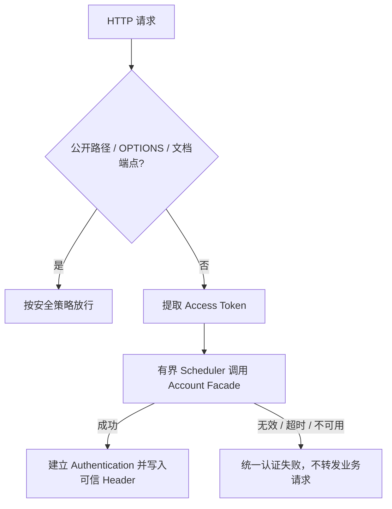

# im-http-gateway

## 模块作用

`im-http-gateway` 是 HTTP API 网关服务，负责接收外部 HTTP 请求，并通过 Spring Cloud Gateway 路由到后端业务服务。

主要职责：

- 统一 HTTP 入口和服务发现路由。
- 调用账号服务在线校验 Access Token，生成可信用户与会话版本请求头。
- 清理外部伪造的用户和会话上下文头。
- 补齐并透传 TraceId。
- 统一处理认证失败和鉴权失败响应。

## 目录结构

```text
im-http-gateway/
  src/main/java/com/co/kc/imchat/gateway/http/
    ImHttpApplication.java      # HTTP 网关启动类
    filter/                            # Spring Cloud Gateway 全局过滤器
    security/
      authentication/                  # Spring Security 认证转换、认证管理、认证成功处理
      config/                          # WebFlux Security 配置
      filter/                          # 用户上下文头清理过滤器
  src/main/resources/
    application.yml                    # 网关路由、Nacos、端口等配置
  src/test/java/                       # 路由、安全、过滤器测试
```

## 请求流程

```text
client
  -> im-http-gateway
     -> TraceIdGlobalFilter
     -> UserContextHeaderSanitizingFilter
     -> AuthenticationWebFilter
     -> Spring Cloud Gateway route
     -> im-account / im-message / im-social
```

认证阶段的关键分支：



## 路由说明

当前路由配置在 `src/main/resources/application.yml`：

- `/account/**` -> `im-account`
- `/message/**` -> `im-message`
- `/social/**` -> `im-social`

## 安全边界

- `/account/user/signUp`、`/account/user/signIn` 和 `/account/user/refreshToken` 放行。
- Swagger、Actuator、OPTIONS 放行。
- 其他请求需要认证。
- 认证成功后写入内部用户与会话版本上下文头，后端服务不直接信任外部传入的上下文头。

## 关键技术点

- 使用 WebFlux/Spring Cloud Gateway，过滤器和安全链均为非阻塞模型，不能调用阻塞式业务仓储。
- 路由使用 `lb://` 与 Nacos 服务发现结合，网关不写死业务服务实例地址。
- 外部用户上下文头先清理后重建，形成明确的零信任边界。
- TraceId 进入 MDC/请求头后向下游透传，便于跨服务定位请求。
- HTTP Gateway 只做认证与路由，不承担账号、社交或消息业务规则。
- 阻塞式账号认证在有界专用调度器执行；Dubbo 调用禁用重试并设置严格超时，调用失败时关闭认证。

## 技术难点与失败边界

- Spring Cloud Gateway 运行在 Reactor/WebFlux 上，Account Facade 是阻塞式 RPC。认证必须切换到专用有界 Scheduler，避免占用 event loop；调度容量耗尽与 RPC 超时都按认证不可用处理。
- Header 清理必须早于可信身份写入。若只覆盖 Header 而不先清理，后续新增字段可能遗漏并信任客户端输入。
- TraceId 是诊断元数据，不是身份或授权依据；即使调用方提交 TraceId，也不能影响认证结果。
- 路由成功只表示请求已交给下游实例。业务事务、幂等和响应语义由目标服务负责。
- Account 认证/鉴权失败由安全链返回统一 `HttpResult`；Nacos 没有可用实例或下游连接失败属于路由传输失败。两类失败都不得在本地回退为匿名成功，但当前文档不承诺它们使用同一错误适配器。

## 验证命令

```bash
mvn -q -pl im-gateway/im-http-gateway -am test
```
