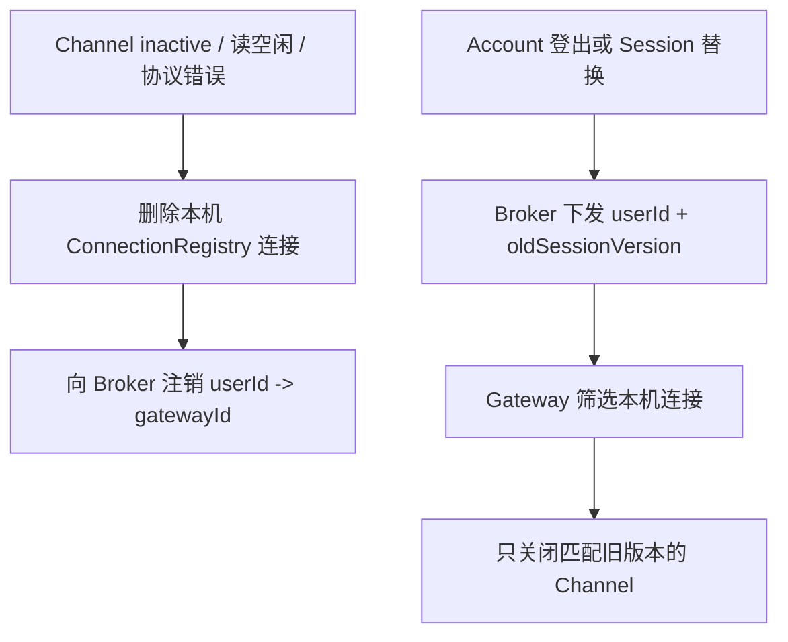

# im-ws-gateway

## 模块作用

`im-ws-gateway` 是 WebSocket 网关聚合模块，按“调用 SDK”和“运行服务”拆分子模块。

它负责支撑浏览器客户端的实时连接接入，以及 Broker 到 WS 网关的内部推送调用。

## 模块结构

```text
im-ws-gateway/
  im-ws-gateway-sdk/       # WS 网关内部调用 SDK
  im-ws-gateway-server/    # WS 网关运行服务，基于 Netty 接入 WebSocket
  pom.xml                  # WS 网关聚合 POM
```

## 子模块职责

- `im-ws-gateway-sdk`：定义 Broker 推送到指定连接所需的参数、DTO、Bolt RPC 标识和调用客户端。
- `im-ws-gateway-server`：启动 Netty WebSocket Server，维护本机连接，注册网关信息到 Broker，并处理 Broker 下行推送。

## Socket 与 WebSocket 连接生命周期

浏览器先与 WS Gateway 建立 TCP Socket 连接，再通过该连接发送 HTTP Upgrade 请求。握手认证和协议升级成功后，客户端与 Gateway 继续复用同一条 TCP 连接，以 WebSocket 帧进行全双工通信，而不是为每条消息重新创建 HTTP 请求。

升级后的文本帧承载 IM 业务协议，ping/pong 心跳与空闲检测用于判断连接是否仍然可用。每个 Gateway 只管理落在本机的 Channel、连接 ID 和连接生命周期；它把用户到 Gateway 的在线位置注册给 Broker。上行帧由 Gateway 转交 Broker 路由到业务服务，下行通知则由 Broker 先定位目标 Gateway，再由该 Gateway 写入自己持有的本机连接。

具体的握手顺序、Netty pipeline、空闲处理和 Channel 清理见 [Server README](im-ws-gateway-server/README.md)。

## 核心链路

上行消息：

```text
web client
  -> Netty WebSocket
  -> im-ws-gateway-server
  -> Broker
  -> message service
```

下行推送：

```text
message service
  -> Broker
  -> im-ws-gateway-sdk client
  -> im-ws-gateway-server
  -> web client
```

客户端对需确认通知的 ACK 作为上行帧沿同一路径返回 Message service。Gateway 只转发 ACK，不保存回执任务，也不决定重投。

连接关闭与异常清理：



Broker 暂时不可用时，Gateway 保留仍然活跃的本机 Channel，并由生命周期任务重试网关注册和心跳；但连接路由注册、上行转发与新的跨节点下行可能失败。详细失败和一致性边界见 [Gateway Architecture](../ARCHITECTURE.md)。

## 边界说明

- WS 网关只负责连接、协议帧和路由转发，不处理消息业务逻辑。
- Broker 负责用户到 Gateway 的在线路由和服务转发，不持有 Gateway 本地 Channel。
- 业务服务通过 Broker 精准推送到用户所在的 WS 网关。

## 关键技术点

- SDK 与 Server 分离，使 Broker 只依赖调用契约，不依赖 Netty 运行实现。
- 具体连接只存于所属网关；集群层只同步用户与网关位置。
- 上行和下行都经过 Broker，统一在线路由与业务服务调用边界。
- Gateway 的逐连接写入结果表示本机是否接受写入，不等同于客户端已经处理通知。

## 验证命令

```bash
mvn -q -pl im-gateway/im-ws-gateway/im-ws-gateway-server -am test
```
