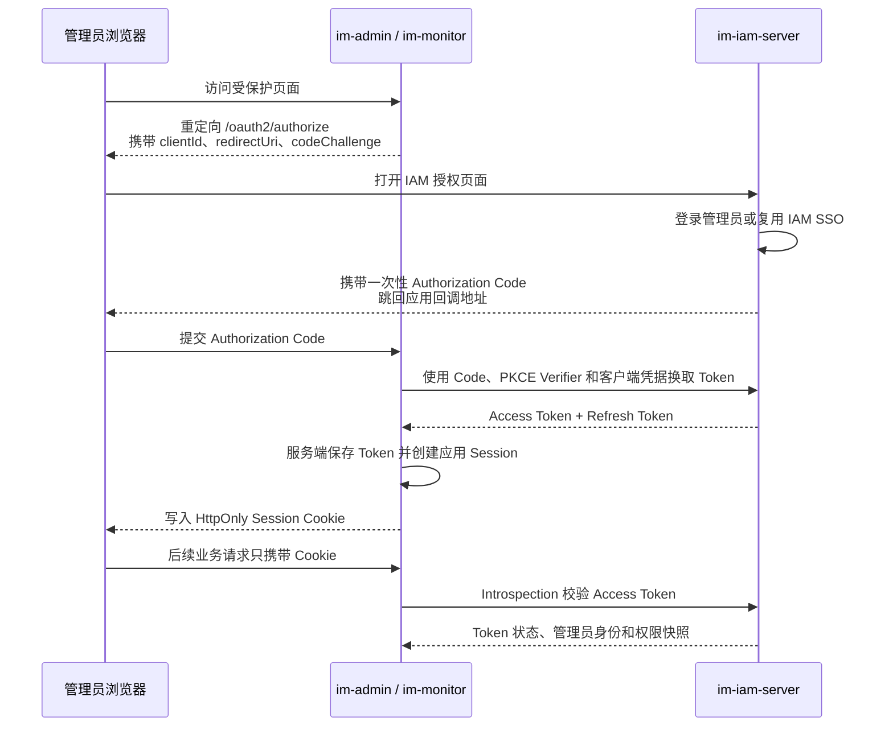
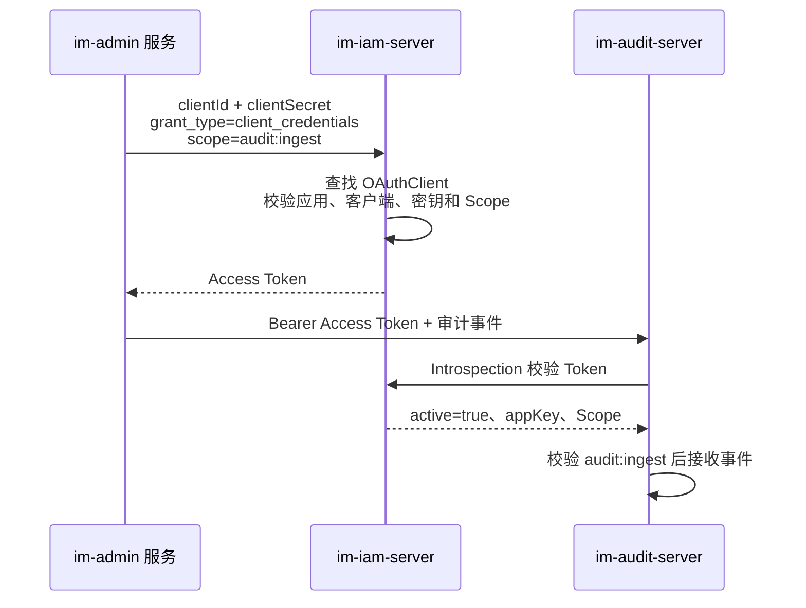
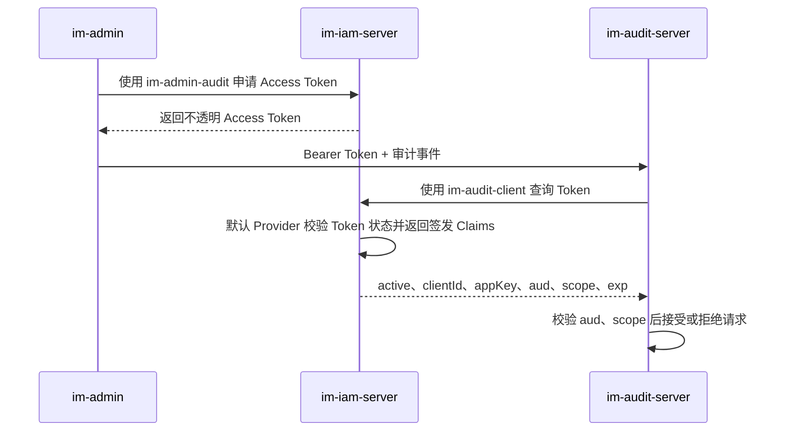

# IM IAM

`im-iam` 是管理平台统一身份与权限中心。它只服务 `im-admin`、`im-monitor` 等管理应用，
不复用普通 IM 用户的 Account 认证体系。

## 模块职责

- `im-iam-server`：独立部署，拥有管理员身份、接入应用、权限目录、应用级角色、OAuth2/OIDC
  授权、会话撤销、浏览器应用和机器客户端；
- `im-iam-sdk`：供 `im-admin`、`im-monitor` 接入统一登录、BFF Session、Token Introspection
  与权限目录同步，不依赖服务端实现。

权限目录由 SDK 在应用启动后通过受 IAM Client Credentials 保护的 HTTP 接口同步。同步使用独立
Catalog 机器客户端，不复用 Authorization Code 浏览器客户端。IAM 不再为同一用例维护并行的
Dubbo RPC 契约，避免两套入口出现认证、请求模型和行为偏差。

管理应用通过 SDK 使用 IAM，但仍独立拥有自己的业务接口、页面和权限定义。SDK 不包含 IAM
服务端的管理员、角色或应用领域实现。

## 领域位置与上下文地图

| 限界上下文 | 主要职责 | 核心模型 |
|---|---|---|
| 管理员身份 | 管理员凭据、状态、密码校验及身份生命周期 | `Administrator` |
| 应用授权 | 业务应用与 OAuth 客户端注册、IAM 内部角色、应用权限目录、应用角色和管理员授权 | `Application`、`OAuthClient`、`IamRole`、`ApplicationPermission`、`ApplicationRole` |
| OAuth 授权 | 浏览器或机器主体的授权、当前凭据、Scope、撤销以及管理侧授权会话投影 | `OAuthAuthorization`、`OAuthSession` |

三个上下文由同一个 `im-iam-server` 部署承载，但领域模型、仓储和生命周期边界保持独立；部署边界
不等于领域边界。管理应用中的 BFF Session 属于各应用 SDK 集成状态，不是 IAM Server 的
`OAuthAuthorization` 或 `OAuthSession`。

## 统一语言

| 上下文 | 业务术语 | 类型 | 建模名称 |
|---|---|---|---|
| 管理员身份 | 管理员 | 聚合根 | `Administrator` |
| 管理员身份 | 管理员标识、用户名、邮箱、原始/加密密码、状态 | 值对象 | `AdministratorId`、`AdministratorUsername`、`AdministratorEmail`、`AdministratorRawPassword`、`AdministratorPassword`、`AdministratorStatus` |
| 管理员身份 | 管理员与密码规则 | 领域服务 | `AdministratorService`、`PasswordService` |
| 应用授权 | 接入应用、OAuth 客户端 | 聚合根 | `Application`、`OAuthClient` |
| 应用授权 | 应用标识与业务编码、OAuth 客户端标识 | 值对象 | `AppId`、`AppKey`、`OAuthClientId` |
| 应用授权 | IAM 内部角色、应用权限、应用角色 | 聚合根 | `IamRole`、`ApplicationPermission`、`ApplicationRole` |
| OAuth 授权 | OAuth 授权 | 聚合根 | `OAuthAuthorization` |
| OAuth 授权 | 授权标识、主体、Access/Refresh Token、授权码 | 值对象 | `OAuthAuthorizationId`、`OAuthPrincipal`、`OAuthAccessToken`、`OAuthRefreshToken`、`OAuthAuthorizationCode` |
| OAuth 授权 | 管理侧授权会话 | 只读投影 | `OAuthSession` |
| OAuth 授权 | 授权与撤销规则 | 领域服务 | `OAuthAuthorizationService` |

下文继续说明这些术语在权限目录、Authorization Code + PKCE、Client Credentials、Token
Introspection 和撤销流程中的具体关系，不在此表重复协议步骤。

## IAM 解决什么问题

如果每个管理应用分别实现账号、密码、登录 Session 和角色管理，会出现多套安全边界，管理员也需要
重复登录。IAM 将这些公共能力集中起来：

- 管理员只在 IAM 输入账号和密码；
- `im-admin`、`im-monitor` 通过标准 OAuth2/OIDC 流程接入；
- IAM 统一管理管理员、应用、角色和权限；
- 各管理应用仍通过 SDK 提供的 `@RequiresPermission` 执行业务鉴权；
- 服务之间可以使用独立的机器客户端申请 Token，不冒充管理员。

## OAuth2 中的参与者

结合本项目，可以把 OAuth2 理解为“由 IAM 给受信任的应用发放有限期访问凭证”：

| OAuth2 角色 | 本项目中的对象 | 职责 |
|---|---|---|
| Authorization Server | `im-iam-server` | 认证管理员或机器客户端，并签发、刷新、校验和撤销 Token |
| Client | `im-admin`、`im-monitor` 或审计生产者 | 向 IAM 申请 Token |
| Resource Server | 接收受保护请求的管理服务 | 校验 Token 和权限后执行接口 |
| Resource Owner | 管理员 | 在浏览器登录流程中授权应用代表自己访问 |

OAuth2 的“Client”不是 Java SDK 中的普通远程调用类，而是一套向 IAM 证明调用方身份的注册信息。

## 管理应用权限声明

IAM 内部管理权限与管理应用权限是两套不同语义：IAM 内部权限只保护 IAM 自身管理接口，使用 IAM Server 内部静态定义；`im-admin`、`im-monitor` 等应用权限由应用声明并通过权限目录同步。即使基础设施层复用存储，也不能混用领域对象、应用服务或同步入口。

数据库层按授权边界物理隔离：

- IAM 自身角色与管理员分配使用 `db_iam_internal_role`、`db_iam_internal_administrator_role`；
- 外部应用角色、权限及分配关系使用 `db_iam_application_role`、`db_iam_application_permission`、
  `db_iam_application_role_permission`、`db_iam_application_administrator_role`；
- IAM 内部权限编码由 IAM Server 静态定义，只在内部角色中保存编码集合，不进入外部应用权限目录。

领域类型同样显式标识所属范围：接入应用使用 `ApplicationPermission`、`ApplicationRole`，IAM
自身使用 `IamPermissionCode`、`IamRole`。两套模型分别拥有自己的 ID、编码、名称、状态和类型，
不复用无范围语义的 `Permission`、`Role` 或其值对象。

OAuth 授权生命周期保留在独立的 `domain/session` 边界：`OAuthAuthorization` 是协议授权及其
当前凭据状态的聚合根，使用 `OAuthAuthorizationId` 标识；`OAuthSession` 只是管理端在线授权列表的
只读投影，复用同一个 `OAuthAuthorizationId`，不再创建第二套 Session 身份或伪造 SSO Session 摘要。

管理应用使用自身权限目录的编译期编码保护接口，权限编码同时用于启动时向 IAM 全量同步：

```java
@RequiresPermission(AdminPermission.Code.USER_READ)
public PagingResult<ManagedUserResponse> page(...) {
}
```

`@RequiresPermission` 是 `im-iam-sdk` 对 Spring Security `@PreAuthorize` 的薄组合注解。
SDK 只负责把注解值展开为标准 `hasAuthority` 表达式，不实现第二套授权 AOP 或权限判断。
当前仅提供单权限语义；出现真实的任意权限或全部权限用例后，再分别增加语义明确的组合注解。

## 应用标识与 OAuth 客户端标识

IAM 同时存在业务应用标识、OAuth2 协议标识和数据库内部标识，它们不能混用：

| 类型 | 示例 | 含义 |
|---|---|---|
| 数据库 `id` / `Identification.pkId` | `42` | 当前聚合表行的技术主键，不用于跨表关联或外部契约 |
| `AppId` | `10001` | `Application` 的 Snowflake 业务标识，供 IAM 表之间关联 |
| `AppKey` | `imAdmin` | 业务应用的可识别编码，供配置、管理页面和 Token Claim 使用 |
| `OAuthClientId` | `im-admin-web` | OAuth2 协议中的 `client_id`，用于选择具体的客户端配置 |

一个业务应用可以使用多套 OAuth2 客户端身份。例如：

```text
AppKey: imAdmin
├── OAuthClientId: im-admin-web
│   └── 管理员通过浏览器登录 im-admin
└── OAuthClientId: im-admin-audit
    └── im-admin 服务向 Audit 服务提交审计事件
```

`AppKey` 回答“这是哪个业务应用”，`OAuthClientId` 回答“本次使用哪套 OAuth2 客户端配置”。

应用和 OAuth 客户端分两步注册：先创建只包含业务身份和状态的 `Application`，再以其 `AppKey`
创建一个或多个 `OAuthClient`。两步使用独立用例和事务；应用可以暂时没有客户端，某个客户端注册
失败也可以单独重试，不会回滚或重复创建应用。

## 管理员浏览器登录

浏览器登录使用 Authorization Code + PKCE。`im-admin` 和 `im-monitor` 是 BFF：Token 只保存在
应用服务端，浏览器只持有 HttpOnly Session Cookie。



这条流程由一个 `Application` 和其下的浏览器 `OAuthClient` 共同表达：

- `Application` 保存 `AppId`、`AppKey`、`AppName` 和 `AppStatus`；
- `OAuthClient` 保存 `OAuthClientId`、所属应用 `AppId`、目标应用 `audienceAppId`、加密后的客户端
  密钥、Grant Type、Scope、登录回调地址与退出回调地址白名单；
- 浏览器客户端使用 `authorization_code`、`refresh_token` 和 PKCE。

Authorization Code 是短期且只能使用一次的交换凭证；PKCE 防止 Code 被截获后直接使用；Access Token
用于访问受保护资源；Refresh Token 仅由应用服务端用于获取新的 Access Token。

## 服务间机器调用

没有管理员参与的服务间调用使用 Client Credentials。例如 `im-admin` 向 Audit 提交审计事件时，
使用独立机器客户端申请只包含 `audit:ingest` Scope 的 Access Token。



机器客户端不代表管理员，因此没有登录页面、Authorization Code、回调地址和 Refresh Token。它只使用
自己的 `OAuthClientId`、Secret 和获准的 Scope。

## Token Introspection

Token Introspection 是资源服务器向 IAM 发起的实时 Token 状态查询。当前 IAM 签发的是不透明
Access Token，Token 本身只是一个高熵随机字符串，资源服务器不能仅根据字符串判断它是否过期、撤销，
或具有什么权限，因此必须通过 `/oauth2/introspect` 查询 IAM 保存的授权事实。



申请 Token 的客户端和查询 Token 的资源服务器是两个不同角色。以审计写入为例：

| 字段 | 回答的问题 | 示例 |
|---|---|---|
| `clientId` | 哪个 OAuth 客户端申请了 Token | `im-admin-audit` |
| `appKey` | 该客户端属于哪个来源应用 | `imAdmin` |
| `aud` | Token 允许交给哪个资源服务 | `imAudit` |
| `scope` | Token 在目标服务允许执行什么操作 | `audit:ingest` |

因此，`clientId`、`appKey`、`aud` 和 `scope` 不能互相替代：

```text
clientId / appKey = 谁申请了 Token
aud               = Token 可以在哪里使用
scope             = Token 到达目标服务后可以做什么
```

资源服务器调用 Introspection 时使用自己的客户端身份。例如 `im-audit-server` 使用
`im-audit-client` 查询由 `im-admin-audit` 申请的 Token。Spring 默认 Provider 只确认查询方已完成
Client Authentication，并返回 Token 的标准状态与签发 Claims；资源服务器负责校验 Token 的 `aud`
是否包含自身应用。

有效机器 Token 的查询结果类似：

```json
{
  "active": true,
  "client_id": "im-admin-audit",
  "appKey": "imAdmin",
  "aud": ["imAudit"],
  "scope": "audit:ingest",
  "exp": 1788339600
}
```

IAM 默认 Provider 根据以下事实返回 `active=true`：

- Token 摘要存在、尚未过期且未撤销；
- Introspection 调用方已经完成 OAuth Client Authentication。

资源服务器随后校验 `aud` 与 Scope/Authority。Authorization Code 由 Spring 保证只消费一次；Refresh
Token 每次使用后轮换，旧 Token 再次提交时返回 `invalid_grant`。IAM 不保留 Refresh Token 历史索引，
数据库始终不保存可直接使用的 Code 或 Token 原文。

管理员权限在 Access Token 签发和刷新时形成快照。管理员禁用、删除、改密、退出或 Session 撤销会
主动撤销授权；普通角色权限变更最迟在 15 分钟 Access Token 到期后生效。管理应用仅在 IAM 连接失败、
请求超时或明确返回 `5xx` 时使用最近一次成功缓存，缓存不得超过五分钟，也不得超过 Access Token 的
过期时间。

`aud` 是 OAuth 标准 audience 元数据，不要求编码在不透明 Token 字符串中。IAM 将其保存在授权元数据，
并通过 Introspection 返回。`appKey` 是本项目扩展字段，用于表达可信来源应用；它必须由 IAM 根据持久化
客户端关系产生，不能信任请求体提交的来源字段。

## `domain/application/model` 对象关系

```text
Application 1 ─────────────────────── N OAuthClient
├── AppId                            ├── OAuthClientId
├── AppKey                           ├── AppId（所属应用）
├── AppName                          ├── OAuthClientName
└── AppStatus                        ├── OAuthClientStatus
                                     ├── audienceAppId（目标应用）
                                     ├── OAuthClientSecret
                                     ├── Set<OAuthGrantType>
                                     ├── Set<OAuthScope>
                                     ├── Set<RedirectUri>
                                     └── Set<postLogoutRedirectUri>
```

| 对象 | 作用 |
|---|---|
| `Application` | 接入 IAM 的业务应用聚合；负责应用身份和状态 |
| `OAuthClient` | 应用下的一套 OAuth 接入配置；同时声明拥有方 `AppId` 与 Token 目标 `audienceAppId`，浏览器和机器客户端通过 Grant Type 区分 |
| `OAuthClientId` | OAuth2 的公开客户端标识，不是密码 |
| `OAuthRawClientSecret` | 注册或轮换时短暂存在的明文密钥，不能持久化或写入日志 |
| `OAuthClientSecret` | 经过 BCrypt 处理、可安全持久化的客户端密钥 |
| `OAuthGrantType` | 客户端允许使用的标准 OAuth 授权方式 |
| `OAuthScope` | 客户端被允许申请的协议级访问范围 |
| `RedirectUri` | IAM 完成浏览器授权后允许跳回的精确地址 |

## Secret、Token、Scope 与业务权限

Secret 用于证明 OAuth2 客户端身份，Token 用于证明一次已经完成的授权，两者不是同一个对象：

```text
OAuthRawClientSecret
        │ BCrypt
        ▼
OAuthClientSecret（数据库安全存储）
        │ 客户端认证成功
        ▼
Access Token（有限期访问凭证）
```

- 原始 Client Secret 只在注册和轮换边界短暂存在；数据库不保存原文；
- IAM 当前签发不透明 Access Token，业务服务通过 Introspection 获取实时状态；
- 浏览器 Token 代表“管理员通过某个应用访问”，机器 Token 代表“某个应用自身访问”；
- `OAuthScope` 是协议级访问范围，例如 `audit:ingest`；
- `iam:administrator:read` 等业务权限属于管理员在具体应用中的权限，不应与机器 Scope 混为同一概念；
- Client Secret、Access Token、Refresh Token、Authorization Code 和 Cookie 不能进入日志或普通业务响应；
  OAuth2/OIDC 协议端点只向经过校验的客户端返回流程必需的 Code 或 Token。

## 子模块与验证

- [`im-iam-server`](im-iam-server/README.md)：管理员身份、应用授权、OAuth2/OIDC 协议和 IAM 管理控制台。
- [`im-iam-sdk`](im-iam-sdk/README.md)：管理应用的 BFF Session、Introspection、权限目录同步和安全适配。

```bash
mvn -q -pl im-management/im-iam/im-iam-sdk,im-management/im-iam/im-iam-server -am test
./scripts/verify.sh architecture
```

## 进一步阅读

详细设计见
[`docs/design-docs/2026-08-26-management-iam-design.md`](../../docs/design-docs/2026-08-26-management-iam-design.md)，
当前执行进度见
[`docs/exec-plans/completed/2026-08-26-management-iam.md`](../../docs/exec-plans/completed/2026-08-26-management-iam.md)。

IAM 的登录、Token、撤销、协议失败和特权写操作通过 `im-audit-sdk` 发布 SECURITY 审计，
不再拥有本地安全审计表、查询接口或页面。集中审计设计见
[`2026-08-28-central-management-audit-design.md`](../../docs/design-docs/2026-08-28-central-management-audit-design.md)。
