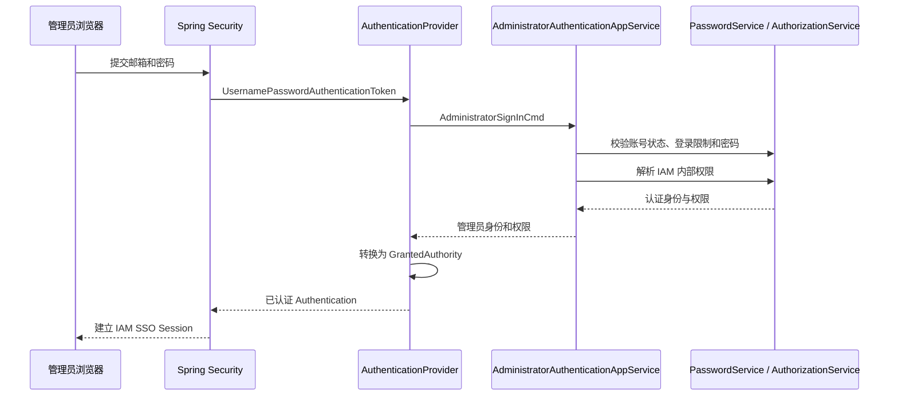
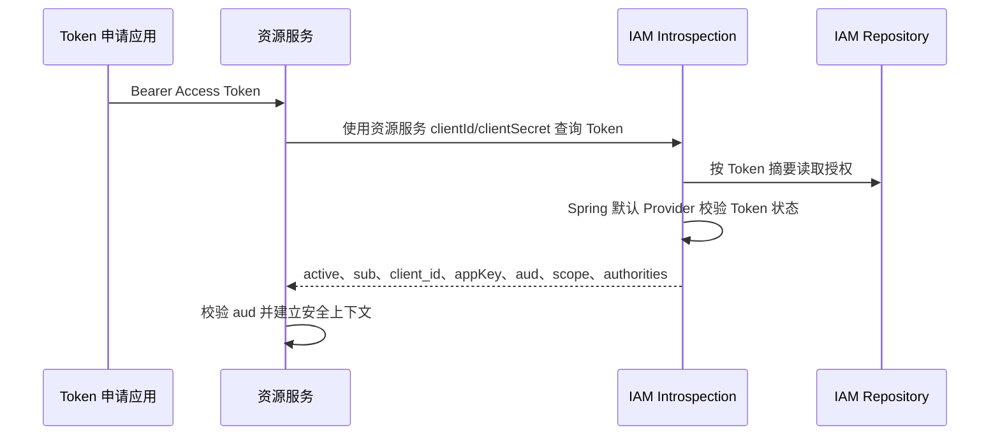
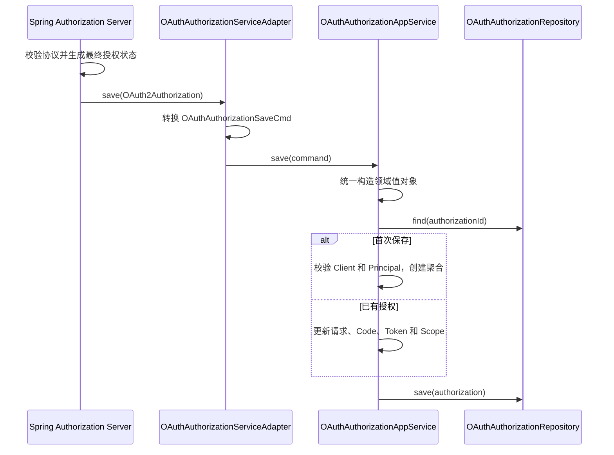
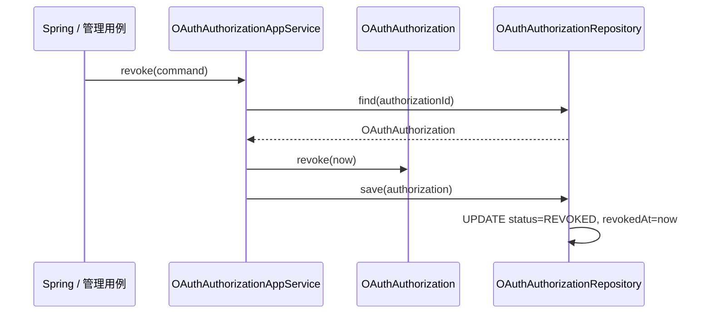

# IM IAM Server

统一管理端身份与授权中心，提供 OAuth2 Authorization Code + PKCE、OIDC、Opaque Token、
Introspection、Revocation、应用权限目录、角色授权、在线会话和机器客户端管理。

仓库提供 localhost issuer 和 classpath PKCS12 开发密钥，便于本地联调。生产必须通过 Nacos
覆盖为 HTTPS issuer、外部 PKCS12 签名密钥及正式客户端密钥，并配置数据库/Redis。Access Token
有效期 15 分钟，Refresh Token 旋转且有效期 8 小时；数据库只保存 Token 摘要。

本地开发默认配置如下：

```yaml
im:
  iam:
    authorization:
      issuer: http://localhost:18090
      key-store-location: classpath:iam/iam-signing.p12
      key-store-password: ImChatIamLocalStore_2026!
      key-alias: im-iam-signing
      key-password: ImChatIamLocalStore_2026!
    bootstrap:
      enabled: true
      username: admin
      email: admin@imchat.com
      password: admin
```

HTTP issuer 只允许 `localhost`、`127.0.0.1` 和 IPv6 loopback；其他地址必须使用 HTTPS。
classpath 密钥及仓库内管理应用的 Client Secret、Session 加密密钥都是公开的开发默认值，不能建立
生产信任。生产 Nacos 必须整体覆盖这些配置，并将 `key-store-location` 指向外部 `file:` PKCS12。
本地管理员使用 `admin@imchat.com / admin`；Bootstrap 仅在管理员表为空时创建账号，不覆盖已有数据。

管理员账号的长期业务状态只有启用和禁用。连续登录失败次数与临时登录限制由 Redis
`AuthenticationRestriction` 维护：计数与限制使用同一配置时长自动过期，达到
`im.iam.login.failure-limit` 后临时拒绝登录，成功登录或管理员启用、禁用、删除、重置密码后
清理对应状态。Redis 不可用时登录失败关闭，避免绕过防暴力破解保护；该限制不写入管理员业务表，
审计事件使用 `LOGIN_RESTRICTED` 表达技术限制事实。

IAM 生成业务标识时使用 `im-identity` 提供的 Redis Snowflake 机器租约。
`im.identity.snowflake.data-center-id` 取值为 `0..31`，机器 ID 由 Redis 动态分配；
namespace 未配置时使用 `spring.application.name`。Nacos 可以覆盖租约和心跳参数，详见
`im-plugin/im-identity/README.md`。

## 安全架构

`infrastructure/security` 是 IAM 领域能力与 Spring Security、Spring Authorization Server
之间的适配层。管理员、应用、角色、权限和登录限制等业务规则仍由 application、domain 与 support
层负责，领域层不依赖 Spring Security 类型。

```text
Spring Security / OAuth2 请求
              │
              ▼
infrastructure/security
├── authentication  管理员表单认证适配
├── oauth           OAuth2/OIDC 客户端、Token 与 Introspection 适配
├── session         IAM 浏览器 SSO 生命周期
└── token           Token 摘要等安全技术能力
              │
              ▼
Application Service / Domain Service / Repository
```

| 组件 | 职责 |
|---|---|
| `AdministratorAuthenticationProvider` | 将 Spring Security 表单认证委托给管理员认证应用服务，并把应用服务返回的权限转换为框架 Authority |
| `oauthClientSecretPasswordEncoder` | 为 Spring Authorization Server 校验 BCrypt OAuth Client Secret；不复用管理员密码领域服务 |
| `OAuthRegisteredClientRepository` | 调用 `OAuthClientAppService` 获取已校验的注册 DTO，并委托 `OAuthRegisteredClientTransformer` 构造 Spring `RegisteredClient` |
| `OAuthRegisteredClientTransformer` | 映射 Grant Type、Scope、Redirect URI、PKCE、Token 格式与有效期等 Spring Authorization Server 配置 |
| `OAuthAuthorizationServiceAdapter` | 作为 Spring Authorization Server SPI 入口，将框架对象与协议异常适配到应用用例 |
| `OAuthAuthorizationAppService` | 保存 Spring 处理完成的最终授权状态，并负责授权查询和显式撤销用例 |
| `OAuthAuthorization` | 表达 OAuth 授权族当前状态并维护撤销行为 |
| `OAuthAuthorizationService` | 校验需要跨 OAuth Client 与管理员聚合解析的授权主体 |
| `OAuthAuthorizationRepository` | 保存 OAuth 授权聚合，只持久化 Token 摘要与非敏感元数据 |
| `OAuthTokenClaimsCustomizer` | 将 Spring Token 上下文转换为应用查询，并把 `OAuthClientAppService` 返回的可信身份、应用归属和权限快照写入 Claims |
| `IamOpaqueTokenIntrospector` | 供 IAM 自身直接校验不透明 Access Token，避免递归 HTTP 调用 IAM |
| `IamSsoSessionFilter` | 执行浏览器 SSO 空闲超时和绝对超时，并在失效时清理当前安全上下文 |
| `Sha256OAuthTokenDigester` | 为高熵 OAuth Token 生成不可逆摘要，避免数据库保存可直接使用的 Token 原文 |

### 安全过滤链

IAM Server 使用三条有明确顺序的 `SecurityFilterChain`：

1. `oauthSecurityFilterChain` 只匹配 OAuth2/OIDC 协议端点，负责授权、Token、Introspection、撤销和 OIDC 登出；
2. `iamClientApiSecurityFilterChain` 只匹配权限目录同步接口，使用无状态 Opaque Bearer Token；
3. `iamWebSecurityFilterChain` 负责 IAM 登录页面、管理接口和静态资源，只使用管理员表单登录与 SSO Session。

IAM 自身管理 UI 使用 IAM Vue 登录页和 Spring Security Form Login，并保留同源 Cookie CSRF。登录后通过
`GET /api/iam/me` 获取管理员 ID 与权限，仅控制菜单和按钮可见性；Controller 上的权限注解仍是
最终授权边界。UI 使用 Hash Router，应用详情以稳定 `appId` 加载权威数据，并在同一上下文中通过
OAuth Client、角色和权限目录三个 Tab 管理访问配置。旧的 application-access 路由保留重定向并落到角色 Tab。

OAuth Client 列表通过 `GET /api/iam/oauth-clients/page` 按所属应用稳定分页，展示 Client ID、目标应用、
Grant Type、Scope、回调地址和状态，不返回原始 Secret、Secret 摘要或授权 Token。应用注册、Client 注册、
密钥轮换、角色创建和管理员资料操作使用右侧抽屉；失败保留输入，成功后提示并重新读取权威数据。停用、
删除、会话撤销和密钥轮换均明确展示影响后再确认。列表加载、空结果、失败重试和局部 Pending 状态相互区分，
刷新或翻页失败不会清空上一份成功数据。

管理员的 IAM 内部角色分配使用服务端角色目录与当前分配结果组成多选项，不再要求填写角色 ID。应用详情的
“成员授权”只维护该应用下的角色关系，IAM 内部角色和其他应用的角色不会被替换；应用角色编辑可以修改名称和
权限集合，角色编码保持不变。OAuth Client 的访问配置可以修改 Scope 以及浏览器 Client 的回调 URI，Client
身份、所属应用、目标应用和 Grant Type 保持不变。角色权限、应用角色分配和 Client 访问配置变更后会撤销
受影响的 OAuth 授权，下一次登录或换取 Token 才会得到新的权限快照。

IAM 的 OpenAPI 页面位于 `GET /api/doc.html`，协议描述位于 `GET /v3/api-docs`。文档端点沿用
`iamWebSecurityFilterChain` 的管理员 Session 认证，不对匿名请求公开。

直接进入 IAM 后台时，登录页通过仅允许 `/` 或 `/#/` 的 `continue` 恢复 Hash Router 路由；OAuth
授权触发登录且没有显式 `continue` 时，成功处理器恢复 Spring Security 保存的 Authorization Request，
两种跳转不会互相覆盖。失败登录保留合法后台目标并显示统一错误提示。

UI 变更执行 `npm run lint`、`npm run format:check`、`npm run test:unit`、`npm run typecheck` 和
`npm run build`；前四项验证源码质量与行为，生产构建产物随 IAM Server JAR 发布。

四个管理端使用一致的 Element Plus 高密度运维控制台：页面只展示本应用拥有的功能。
“其他控制台”链接由各 UI 的 `src/config/consoleLinks.ts` 管理，本地默认地址可分别通过
`VITE_IAM_CONSOLE_URL`、`VITE_AUDIT_CONSOLE_URL`、`VITE_MONITOR_CONSOLE_URL` 和
`VITE_ADMIN_CONSOLE_URL` 在构建时覆盖。创建、编辑和详情使用右侧抽屉，危险操作必须显式确认，
刷新失败时保留最近一次成功数据。
IAM 本地服务默认运行在 `http://localhost:18090`。

`im-iam-sdk` 为接入应用提供的默认 `iamSecurityFilterChain` 不属于 IAM Server；服务端使用独立命名，
避免混淆两类安全边界或产生 Bean 名冲突。

SDK 的 `IamBffController` 统一提供接入应用所需的 `/iam/login`、`/iam/callback`、`/iam/me` 和退出端点，
由 SDK AutoConfiguration 在 Admin、Monitor、Audit 等客户端应用中注册。IAM Server 是授权服务器，不使用
这些 BFF 端点，也不直接或传递依赖 `im-iam-sdk`。`im-audit-sdk` 将 IAM 安全上下文集成声明为 optional：
接入应用显式依赖 IAM SDK 时采集管理员主体，IAM Server 未引入时使用通用 Spring Security 审计主体，
因此不需要在启动类维护 SDK 扫描排除规则。

两条链共享管理员 SSO 生命周期控制。`IamSsoSessionFilter` 在
`SecurityContextHolderFilter` 之前执行，绝对有效期到期时同时失效 HttpSession 并清理当前
`SecurityContext`，保证当前请求不能继续使用过期身份。

### 管理员登录



账号不存在、账号不可用和密码错误对外统一返回认证失败。账号不存在时仍执行一次 BCrypt 校验，降低
通过响应耗时枚举管理员账号的风险。连续失败限制只属于可自动过期的安全技术状态，不写入管理员聚合。

### OAuth Token 发放

浏览器应用使用 Authorization Code + PKCE，机器调用使用 Client Credentials。OAuth Client 加载时
必须同时满足以下条件：

- OAuth Client 处于启用状态；
- Client 所属 Application 处于启用状态；
- Client 配置的 Audience Application 处于启用状态；
- 请求的 Grant Type、Scope 和回调地址属于 Client 注册范围。

Access Token 是有效期 15 分钟的不透明随机值，Refresh Token 有效期 8 小时且每次使用后轮换；OIDC
ID Token 使用配置的 PKCS12 RSA 密钥签名。本地默认从 classpath 加载公开开发密钥；生产必须使用
HTTPS issuer，并通过 Nacos 覆盖为外部挂载的 PKCS12 与正式客户端密钥。

### Token Introspection

资源服务不能直接解析不透明 Access Token，需要使用自己的 OAuth Client 调用 IAM Introspection：



Introspection 使用 Spring Authorization Server 默认的
`OAuth2TokenIntrospectionAuthenticationProvider`，IAM 不再替换默认 Provider：

```text
OAuth2TokenIntrospectionEndpointFilter
                 │
                 ▼
ProviderManager
└── OAuth2TokenIntrospectionAuthenticationProvider
```

`client_id` 表示申请 Token 的 OAuth Client，`appKey` 表示来源业务应用，`aud` 表示 Token 允许访问的
目标应用，`scope` 表示协议授权范围。上述 Claims 在签发时由 IAM 根据持久化关系生成，不接受请求体
覆盖。资源服务负责校验自己的 `appKey` 是否包含在 `aud` 中。

管理员权限在 Access Token 签发和刷新时生成快照，并由默认 Introspection Provider原样返回。权限
变更最迟在当前 15 分钟 Access Token 过期后生效；管理员禁用、删除、改密和主动退出仍通过撤销授权
立即失效。

OAuth 授权主体由 `principal_type` 与 `principal_name` 组成。管理员使用 `ADMINISTRATOR + 管理员业务 ID`，机器客户端使用
`CLIENT + OAuth Client ID`；主体类型只属于 IAM 内部模型，不作为 OAuth 标准 Claim 暴露。管理员认证成功后，Spring
Security Principal 和管理员 Token 的 `sub` 都使用管理员业务 ID，用户名仅作为登录结果和展示 Claim 保留；机器客户端授权不存在管理员主体属性。

### 授权状态与 Token 安全

`db_iam_authorization` 保存一条 OAuth 授权的当前状态，不是接口鉴权日志。Authorization Code 兑换、
Access Token 签发、Refresh Token 轮换和授权撤销都更新该授权记录。数据库只保存 SHA-256 摘要，原始
Code 和 Token 只在协议边界短暂存在。

领域中使用 `OAuthAuthorization` 表达上述授权族；管理端展示的 `OAuthSession` 是它的在线授权投影，
并不代表独立的浏览器 `HttpSession` 聚合。两者共享 `OAuthAuthorizationId`，数据库也不根据授权 ID
派生或保存伪 SSO Session 摘要。授权码尚未兑换时，在线投影使用授权码过期时间；签发 Token 后优先
使用 Refresh Token、其次 Access Token 的过期时间。

OAuth Client 的回调地址以及授权记录中的 Access Token/ID Token Claims 使用 MySQL JSON 列。
OAuth Client Entity 以原始 JSON `String` 承接回调地址，由领域 Transformer 使用 `JsonUtils` 转换并
确定性写回；授权 Claims Entity 仍以 `Map` 承接并通过 `JacksonTypeHandler` 映射。`im-datasource`
将应用统一 `ObjectMapper` 提供给 TypeHandler，确保 Token Claims 中的 `Instant` 可以稳定持久化。
JSON 读取后的标准时间 Claim 由 Spring 授权 Transformer 在构建
`OAuth2Authorization` 时恢复为 `Instant`，数据库 Transformer 不依赖 Spring Claim 类型。密码、
Client Secret 和 Token 摘要不会进入 Entity 的 `toString()`。

Spring Authorization Server 调用 `OAuthAuthorizationServiceAdapter` 时，该 SPI 只负责框架对象转换和
OAuth 协议异常映射。授权请求建立、Authorization Code 兑换和 Refresh Token 刷新完成后，Spring 都会
把完整的最终 `OAuth2Authorization` 交给同一个 `save` 回调；IAM 不在保存阶段重复执行兑换或刷新。



应用服务入口先将 Command 的基础值统一转换为领域对象，再查询已有授权。首次保存时校验 OAuth Client
和 Principal 并通过 Builder 创建聚合；后续保存更新已有聚合的协议状态，因此保留 Repository 恢复的
`pkId`。Repository 继续通过 `pkId` 判断 INSERT 或 UPDATE，数据库主键不进入 Command 或 Builder。

Refresh Token 由 Spring 配置为不复用，每次刷新都会用新 Token 更新当前授权记录。旧 Refresh Token
不保留历史索引，再次提交时无法查询到当前授权，Spring 返回 `invalid_grant`。

### 授权失败与撤销

失败是否落库取决于是否已经识别出需要失效的授权族：

| 场景 | 状态处理 | 协议结果 |
|---|---|---|
| Token 不存在、格式错误或普通校验失败 | 不修改授权；没有可靠目标可以撤销 | `invalid_grant` 或 inactive |
| Authorization Code 已消费后再次提交 | Spring 识别失效 Code，并撤销此前签发的 Token | `invalid_grant` |
| 已轮换 Refresh Token 再次提交 | 旧摘要不再属于当前授权，Spring 拒绝该 Token | `invalid_grant` |
| Spring `remove`、用户退出或管理端主动踢下线 | 进入显式撤销用例并保存 `REVOKED` | 正常完成撤销 |
| OAuth Client 或管理员已停用 | 认证或 Introspection 拒绝；对应管理用例负责批量撤销现有授权 | 拒绝认证或 inactive |
| 数据库保存失败 | 当前事务回滚，不把技术异常伪装成撤销 | 服务异常 |

`OAuthAuthorizationService.findByToken` 是 Spring 的查询 SPI。IAM 将它映射为
`OAuthTokenQuery`，只查询并还原授权，不执行 `revoke` 或 `save`。查询到已撤销授权时返回空；已消费
Authorization Code 仍按失效状态还原，使 Spring Provider 能识别其
协议状态。

主动撤销不依赖 Token 查询。Spring 删除授权时由 `OAuthAuthorizationServiceAdapter.remove` 构造
`OAuthAuthorizationRevokeCmd`；管理端退出、管理员禁用、删除或密码重置也进入对应撤销用例。单个授权
由应用服务加载聚合、调用 `authorization.revoke` 后统一保存；管理员全部授权由会话 Repository 执行
批量撤销。



`save` 不处理撤销，原因是 Spring 只在完成当前协议步骤后把最终授权快照交给它。这个回调可能来自首次
创建授权、授权码兑换、Access Token 签发或 Refresh Token 刷新，本身不表示失败，也无法可靠说明本次
状态变化的触发原因。在 `save` 中根据字段差异猜测失败并撤销，可能把正常刷新或重复持久化误判为攻击。

协议校验失败时 Spring 通常不会产生需要保存的新状态；凭据不存在时 IAM 也没有可靠的授权目标可以撤销。
Spring 默认 Provider 负责授权码单次消费和 Refresh Token 轮换；调用方明确发起退出、禁用和删除时，
应用用例执行撤销。数据库异常属于技术失败，保持事务回滚并上抛，不改变授权业务状态。

`OAuthAuthorizationStatus.EXPIRED` 当前不主动写入。Code 和 Token 是否过期由各自的 `expiresAt` 以及
Spring Security 判断；如果管理查询后续需要持久化的过期状态，再单独设计清理或状态归档流程。

并发兑换与刷新将在授权聚合增加统一乐观锁版本后，由 Repository `save` 的版本校验保证只有一个请求
成功，不再为每种协议动作增加专用条件更新方法。

当前使用 MySQL 作为授权事实源，以保证 Token 当前状态和撤销处于同一事务边界。若未来迁移到 Redis，
应整体迁移授权记录与 Token 索引，并使用 Lua 保证原子状态迁移，不能形成 MySQL 与 Redis 双事实源。

## 管理接口

IAM 管理接口按资源声明最小权限，`IAM_USER` 只表示管理员已经完成身份认证，不能单独访问管理资源。
管理员、应用、角色、权限、在线会话和机器客户端分别使用
`iam:administrator:*`、`iam:application:*`、`iam:role:*`、`iam:permission:read`、
`iam:session:*` 和 `iam:client:write` 权限。审计查询与导出由独立 Audit 应用使用
`audit:read`、`audit:export` 权限提供。

所有可增长列表都接受 `pageNo`、`pageSize`，默认值分别为 `1`、`20`，并返回统一的
`PagingResult`。管理员禁用、删除、密码重置会在同一事务中撤销其有效授权；单独撤销授权和批量撤销
也属于需要审计的管理写操作。登录、Token 签发/刷新/撤销、OIDC 登出和协议失败显式发布
SECURITY 审计，确定性的管理写操作使用 `@Audited`；IAM 不持有本地审计表。

接入配置分两步管理：`POST /api/iam/applications/create` 只注册业务应用，
`POST /api/iam/oauth-clients/create` 再按 `appKey` 注册浏览器或机器 OAuth 客户端。应用可以暂时没有
OAuth 客户端，也可以拥有多个客户端；浏览器客户端必须声明 Authorization Code 和精确回调地址，
机器客户端只使用 Client Credentials 且不声明回调地址。

## 首次初始化

项目尚未上线，不保留旧管理账号和 RBAC 数据的兼容迁移。首次部署执行模块根目录
[`sql/ddl.sql`](sql/ddl.sql) 创建 `im_chat_iam` 全新结构，再通过 `IamBootstrap` 创建首个管理员和 IAM 超级管理员角色。
初始化成功后立即移除初始化密码并关闭 `im.iam.bootstrap.enabled`。

业务应用和 OAuth 客户端通过受保护的管理接口分别创建，不在 DDL 中写入固定业务数据。审计生产者
使用独立的 Client Credentials 客户端，并仅授予 `audit:ingest` Scope；原始客户端密钥由部署环境
安全保存，不进入仓库、日志或普通业务响应。
