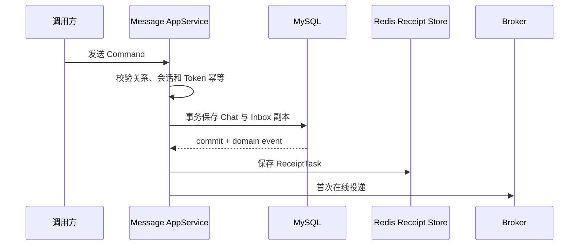
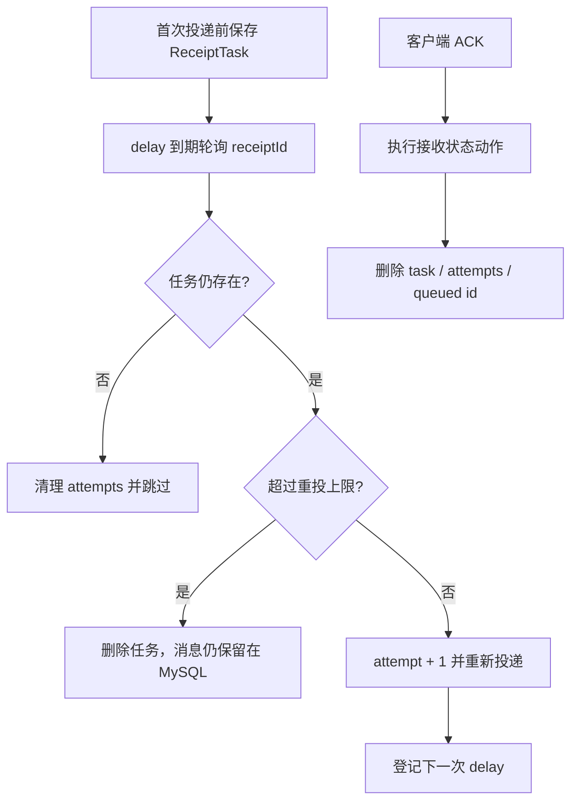

# Message Architecture

## 上下文与职责

`im-message` 在一个部署服务中承载 Chat 与 Message 两个内部上下文：Chat 管理用户视角的私聊/群聊会话、已读和当前查看状态；Message 管理私聊/群聊收件箱副本、发送、接收、已读、撤回与通知事实。模型边界不等于部署边界，但两个上下文通过 Domain Service 和 Application Service 显式协作。

## 存储拓扑

```text
MySQL im_chat_message（持久化事实）
  db_im_private_chat
  db_im_group_chat
  db_im_private_inbox_message
  db_im_group_inbox_message

Redis（可过期运行状态）
  userId -> ImChatView
  receiptId -> ReceiptTask
  receiptId -> attempts
  ReceiptType/hash shard -> delayed receiptId queue
```

MySQL 是聊天和消息恢复来源。Redis Chat View 只参与未读判断；Receipt 状态只参与通知确认与重投。任何 Redis 状态都不替代消息副本或聊天事实。

## 写入与通知边界



- 私聊为发送者和接收者分别保存收件箱副本；群聊为每个目标成员保存用户自己的会话与消息副本。
- 唯一索引以 chat/user/token/message 组合阻止同一用户视角的重复消息，分布式锁只保护应用临界区，数据库约束负责最终防重。
- 通知发生在 MySQL 提交后，Broker/Gateway 失败不回滚消息事实。
- ReceiptTask 与 MySQL 不原子提交，因此当前机制不是 Outbox；进程在提交后、Receipt 保存或重排队列窗口崩溃时可能丢失通知机会。

当前群消息采用 fanout-on-write，在发送事务中生成成员 Inbox/Chat 副本，以写放大换取用户读取、未读和状态维护的局部性。fanout-on-read 或异步/混合 fanout 会改变事务、可见性和恢复语义；只有容量数据证明同步成员副本成为瓶颈时才重新设计，详细权衡见模块 README。

## ACK 与有界重投



重复投递是允许的，客户端与 ACK 处理必须幂等。Gateway 写入成功只证明本机 Channel 接受写入，不证明客户端处理完成。

## 跨上下文与跨服务协作

- Gateway 建立可信用户上下文，Message 不信任外部伪造身份。
- Social Facade 提供好友、群和成员投影；Message 不访问 Social 表。
- Broker 只负责在线路由；Message 拥有 ReceiptTask、ACK 业务动作和重投策略。
- `ImChatView` 属于 Message，不放入 Account Session、Gateway 或 Broker。

## 依赖规则

- `im-message-facade` 只包含跨服务契约，不依赖 Server。
- Domain Repository 描述 Chat/Message 语义；MySQL、Redis、MyBatis 和 Redisson 实现在 infrastructure。
- Application Service 编排事务、锁、跨上下文调用和事件；领域模型不依赖 Spring 或传输 DTO。
- 详细表、Key、索引、配置和故障排查由模块 README 与 Server README 维护，本文只固定所有权和一致性边界。
