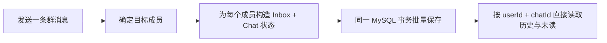
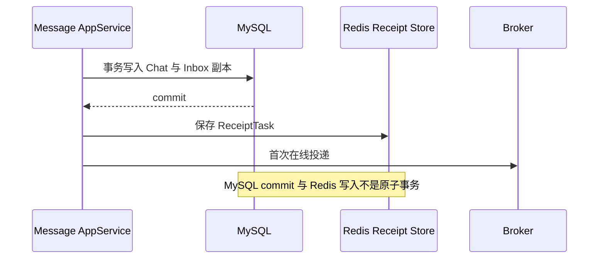

# im-message-server

消息和聊天运行服务，是消息事实、收件箱副本、聊天状态和通知回执任务的所有者。

## 主要职责

- 私聊、群聊消息发送、接收、已读、撤回和历史查询。
- 私聊、群聊会话及当前 `ImChatView` 维护。
- 使用 Gateway 建立的可信用户上下文，并通过 Social Facade 校验好友和群成员关系。
- 将消息领域事件转换为通知，经 Broker SDK 精确推送到在线用户。
- 使用 Redis 保存待确认通知任务、延迟重投标识和重投次数。

## 分层

- `interfaces`：HTTP、Dubbo 和进程内领域事件入口。
- `application`：消息、聊天、通知 ACK 和跨对象用例编排。
- `application/notification`：通知模型、Notifier 选择、回执任务和 ACK 接收规则。
- `domain`：chat、message、social 投影和 sticker 领域模型。
- `adapter`：Social Facade 与其他外部能力适配。
- `infrastructure`：MySQL、Redis、缓存、锁、Broker 通知和仓储实现。

服务名为 `im-message`，默认 HTTP 端口为 `8888`，远程配置从 `SERVICE_GROUP/im-message.yml` 加载。启动依赖 MySQL、Redis、Nacos 和 Dubbo；实时通知通过 Nacos 发现初始 Broker，再由 Broker SDK 定时刷新 Broker 集群快照。

OpenAPI 页面为 `GET /message/api/doc.html`，API description 为 `GET /message/v3/api-docs`。

Message 独占 `im_chat_message` Schema，拥有私聊/群聊会话和收件箱消息表。本地初始化执行模块根目录
[`sql/ddl.sql`](sql/ddl.sql)；群组与用户事实通过 Social、Account Facade 获取，不执行跨 Schema SQL。

稳定的存储所有权与一致性边界见 [Message Architecture](../ARCHITECTURE.md)。

## 存储实现

### MySQL 表与用户视角副本

| 表 | 对应聚合 | 关键字段与索引 | 作用 |
|---|---|---|---|
| `db_im_private_chat` | `ImPrivateChat` | `uk_chat_id(chat_id, is_deleted)`、`uk_user_peer(user_id, peer_user_id, is_deleted)` | 每个用户与对端的私聊会话、读位置和未读数 |
| `db_im_group_chat` | `ImGroupChat` | `uk_chat_id(chat_id, is_deleted)`、`uk_group_user(group_id, user_id, is_deleted)` | 每个群成员自己的群聊会话和群备注 |
| `db_im_private_inbox_message` | `ImPrivateInboxMessage` | `uk_chat_token`、`uk_chat_message`，以及 chat/user/message 查询索引 | 私聊双方各自的收件箱副本 |
| `db_im_group_inbox_message` | `ImGroupInboxMessage` | `uk_chat_user_token`、`uk_chat_user_message`，以及 group/message、user/chat/message 查询索引 | 群成员各自的收件箱副本 |

所有表使用逻辑删除字段 `is_deleted`，唯一索引把该字段纳入当前记录约束。Message Token 用于调用方幂等，messageId 用于消息身份和游标；应用层的分布式锁缩小并发临界区，最终重复写入仍由数据库唯一约束拒绝。

私聊发送在同一事务中保存发送方与接收方两份 `ImPrivateInboxMessage`，并保存双方各自的 `ImPrivateChat`。群聊发送按目标成员保存 `ImGroupInboxMessage` 与 `ImGroupChat`；这是写放大的用户收件箱模型，但读取历史、未读和状态时不需要跨用户临时计算。

### 为什么当前选择 fanout-on-write



写扩散把复杂度放在发送路径：目标成员数决定副本数，同一事务需要保存成员 Inbox 和 Chat 状态；任一数据库写失败会使该次 Message 事务回滚。收益是读取路径不必在每次请求时重新组合群消息、成员生命周期和用户状态，分页游标、接收/已读/撤回时间也直接属于用户副本。

如果改为 fanout-on-read，发送路径可以只保存共享群消息，但读取必须同时处理：用户何时入群或退群、哪些历史消息可见、用户 read cursor、撤回状态、未读统计，以及共享消息与成员关系变化的缓存一致性。它降低写放大，但把成本转移到更高频且延迟敏感的读取路径。

当前实现没有异步 fanout、共享群消息主表或大小群阈值。只有取得群规模分布、消息写 QPS、批量行数、事务耗时、复制延迟和读放大数据后，才评估以下替代方案：

- 小群继续同步写扩散，大群使用共享消息加 read cursor。
- MySQL 事务只写消息事实，再通过可靠 Outbox 异步生成用户 Inbox。
- 对成员副本分批或分区写入，并重新定义部分完成、重试和可见性语义。

这些方案都会改变当前原子性、查询模型和故障恢复方式，必须先更新 Message Architecture、可靠性保证和行为测试。

### Repository 与 MyBatis 边界

```text
Domain Repository
  -> Mysql*Repository：组合聚合查询与保存语义
  -> Db*Service：表级 CRUD、Wrapper 和分页
  -> Db*Mapper / XML：MyBatis SQL
  -> Db* Entity：数据库字段与枚举
```

Domain 和 Application 不直接依赖 Mapper/Entity。Repository 负责领域对象与持久化对象转换，MyBatis Service 提供表级能力；跨表或聚合组合仍由所属 Repository 表达。当前生产 Repository 没有方法级 JetCache 注解，不能把测试中的 `TestCacheConfiguration` 或 `@EnableMethodCache` 误解为消息事实缓存。

### Redis Chat View

| 项目 | 当前实现 |
|---|---|
| Key | `im:message:presence:chat:{userId}` |
| Value | 当前 chatId 的字符串值 |
| TTL | 2 小时，每次打开聊天覆盖并刷新 |
| 清理 | 退出当前聊天或隐藏当前会话时删除 |
| 缺失/无效值 | 按未查看处理，不阻断消息持久化 |

`ImChatView` 只参与发送时的未读判断。它过期或 Redis 暂时没有该值时，系统保守地把接收方视为未查看；MySQL 会话和收件箱仍是恢复来源。

### Redis Receipt Store

| Key/结构 | 内容 | 生命周期 |
|---|---|---|
| `im:message:receipt:delay:tasks` (`RMapCache`) | `receiptId -> ReceiptTask JSON` | delay + 60 秒 grace TTL；ACK、达到上限或成功消费重排时删除/刷新 |
| `im:message:receipt:delay:attempts` (`RMapCache`) | `receiptId -> 已重投次数` | 与任务 delay + grace 对齐；ACK、缺失任务或达到上限时删除 |
| `im:message:receipt:delay:{receiptTypeOrdinal}:{shard}` | `RDelayedQueue` 与到期 `RBlockingDeque`，元素只有 receiptId | 按 `ReceiptType` 和 receiptId hash 分成 `类型数 x 16` 个分片 |

消费者每个分片单独轮询，单批最多处理 10 个到期 receiptId，空队列 poll 最多等待 100ms。首次通知不计入 `MAX_REDELIVER_ATTEMPTS=3`；第 4 次到期消费发现超限时删除任务，不再投递。

### 跨存储一致性



- MySQL 提交成功、ReceiptTask 保存前崩溃：消息可查询，但可能没有在线通知重投。
- ReceiptTask 已保存、Broker 首次投递失败：延迟队列仍可触发后续重投。
- 重投成功后当前实现先删除任务内容、再登记下一次 delay；两步之间崩溃可能丢失后续重投。
- ACK 与到期消费并发时可能观察到残留 receiptId；找不到任务内容时跳过并清理 attempts。
- 重复投递允许发生，因此客户端和 ACK 业务动作必须幂等。该方案提供有界恢复，不提供 exactly-once 或 Outbox 保证。

## 消息写入流程

```text
WS command
  -> Broker
  -> MessageRpcService
  -> PrivateMessageAppService / GroupMessageAppService
       | validate user, chat, friendship or membership
       | validate message token uniqueness
       | build sender and receiver inbox copies
       v
     transaction
       | save inbox messages
       | update chat and unread state
       | publish domain event
       v
     transaction commit
       -> message listener
       -> @AfterTransactionCommit notification method
```

MySQL 中的消息、收件箱副本和聊天状态是持久化事实。通知只在事务成功提交后开始，Broker 或 Gateway 不可用不会回滚已提交消息。接收方离线时，在线推送结果为空，但其消息副本仍可通过聊天和历史接口读取。

私聊发送会根据接收方的 `ImChatView` 判断是否累加未读数；群聊发送为每个接收人维护各自的收件箱和聊天状态。该判断属于 Message 上下文，不依赖 Account Session、Gateway 或 Broker 状态。

## 通知流程

### 通知类型

| 领域事实 | PUSH command | 接收方 | ACK 的业务动作 |
|---|---|---|---|
| 私聊消息已发送 | `message.private.sent` | 私聊对端用户 | 更新接收方消息为已接收 |
| 私聊消息已撤回 | `message.private.revoked` | 私聊对端用户 | 清理待确认任务 |
| 群聊消息已发送 | `message.group.sent` | 除发送者外的群成员 | 更新该成员消息为已接收 |
| 群聊消息已撤回 | `message.group.revoked` | 拥有群聊会话的群成员 | 清理待确认任务 |

群通知按成员自己的 `chatId` 创建独立通知和 `receiptId`。一个用户可以有多个 WebSocket 连接，Broker/Gateway 会返回逐连接投递结果；任一客户端连接发出的有效 ACK 都会确认该用户对应的回执任务。

### 组件职责

| 组件 | 职责 |
|---|---|
| `ImMessageNotifierInvoker` | 选择 Notifier；先登记回执任务，再发起首次通知 |
| `ImMessageNotifierFactory` | 按通知 Java 类型或 `ReceiptType` 定位 Notifier |
| `AbstractBrokerImMessageNotifier` | 生成 PUSH 帧、`eventId` 和 `receiptId`，记录离线或投递失败结果 |
| `MessagePushService` | 通过 Broker SDK 按接收用户推送帧并记录有限基数指标 |
| `ImMessageConfirmableService` | 创建、重放和确认 `ReceiptTask` |
| `RedisImMessageConfirmableStore` | 保存任务内容、延迟队列标识和重投次数 |
| `NotificationAckAppService` | 执行对应 ACK 业务动作并删除回执任务 |

## ACK 与重投

```text
NotifierInvoker
  -> save ReceiptTask(receiptId, type, notification, 2s)
  -> initial Broker delivery

client ACK before delay expires
  -> update receive state when applicable
  -> remove task + queued receiptId + attempt counter

delay expires without ACK
  -> poll receiptId
  -> load ReceiptTask
  -> increment attempt
  -> deliver again
  -> schedule next delay
  -> stop after 3 redelivery attempts
```

Redis 中没有单独的 `PENDING` 或 `CONFIRMED` 状态。任务内容存在表示仍待确认；ACK 会删除任务。延迟队列中偶尔残留但已经找不到任务内容的 `receiptId` 会被直接跳过。

当前 Redis 结构为：

- `receiptId -> ReceiptTask`：完整通知和回执类型。
- `receiptId -> attempts`：已执行的重投次数。
- 延迟队列：只保存 `receiptId`，先按 `ReceiptType`、再按 `receiptId` hash 分片。

默认重投间隔为 2 秒，首次通知后最多执行 3 次重投。通知允许重复到达，客户端必须按 `eventId`、`receiptId` 或消息标识幂等更新界面。

## 可靠性边界

- 消息事实与在线通知分离；推送失败、接收方离线或部分连接失败不删除消息副本。
- 回执任务保存在 Redis，服务重启后其他实例可以继续消费到期任务。
- 当前机制是有界重投，不是与 MySQL 事务原子提交的 Outbox。
- 当前消费流程会先完成一次重投，再删除旧任务并登记下一轮延迟任务；进程在该窗口崩溃时可能丢失后续重投。
- 达到重投上限后任务被删除，不进行无限重试；用户仍可从持久化消息事实恢复内容。
- ACK、通知和客户端展示必须保持幂等，不能依赖“恰好一次”投递。

跨模块可靠性保证和已知债务见仓库 [RELIABILITY.md](../../../docs/RELIABILITY.md)。

## 聊天视图与未读

- `openPrivateChat`、`openGroupChat` 记录当前查看的聊天并把会话读到最新消息。
- `exitChat` 清理当前查看状态。
- `hidePrivateChat`、`hideGroupChat` 隐藏列表项并同步清理当前查看状态。
- `ImChatView` 按用户保存在 Redis，默认有效期为 2 小时；缺失或过期按“未查看”处理。

## 监控与排查

- Broker 推送使用 `im.message.broker.frame.write{outcome=success|failure}` 计数器。
- `im.message.broker.frame.write.duration` 记录 Broker 调用耗时。
- 指标不使用用户、消息、聊天、连接或 Token 作为标签。
- 接收方离线记录 debug 日志；Broker 未处理或存在失败连接时记录 warn 日志。
- 消费回执重投任务异常时记录 error，并把任务重新放回延迟队列。

## 关键约束

- 应用服务在事务内完成校验与落库，事务提交后再触发通知。
- 分布式锁保护消息幂等临界区，数据库约束仍负责最终防重。
- Message 只通过 Facade 读取 Social 投影，不访问其他服务数据库。
- Broker 和 Gateway DTO 不进入消息领域模型，转换在边界完成。

## 验证

```bash
mvn -q -pl im-service/im-message/im-message-server -am test
./scripts/verify.sh behavior
```
